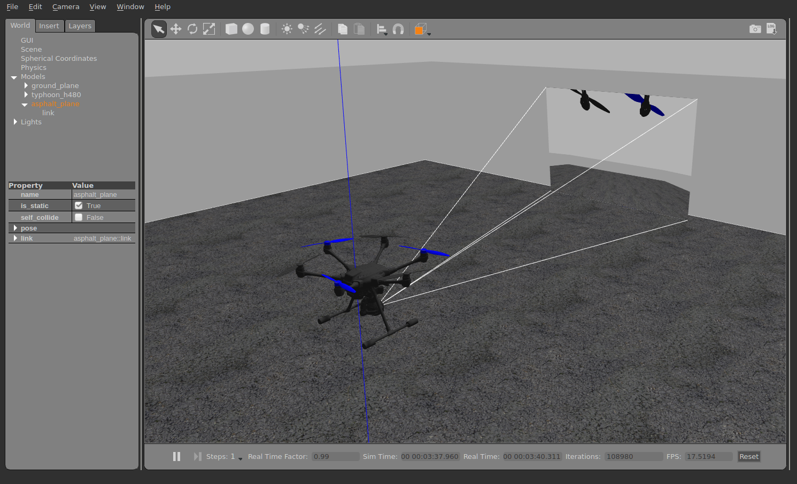

# Gimbal Control Setup

PX4 contains a generic mount/gimbal control driver with different input and
output methods. Any input method can be selected to drive any output.

## Parameters
The parameters are described [here](../advanced/parameter_reference.md#mount). The most
important ones are the input (`MNT_MODE_IN`) and the output (`MNT_MODE_OUT`)
mode. By default, the input is disabled. After selecting the input mode, reboot
the vehicle so that the mount driver starts. Any input method can be selected to
drive any of the available outputs.

If the input mode is set to `AUTO`, the mode will automatically be
switched based on the latest input. To switch from mavlink to RC, a large stick
motion is required.

## Configure the gimbal mixer for AUX output

If the `MNT_MODE_OUT` parameter is set to `AUX`, a mixer has to be configured.
The gimbal uses the control group #2 (see [Mixing and Actuators](../concept/mixing.md)).
This is the basic mixer configuration:

```
# roll
M: 1
O:      10000  10000      0 -10000  10000
S: 2 0  10000  10000      0 -10000  10000

# pitch
M: 1
O:      10000  10000      0 -10000  10000
S: 2 1  10000  10000      0 -10000  10000

# yaw
M: 1
O:      10000  10000      0 -10000  10000
S: 2 2  10000  10000      0 -10000  10000
```

Add those you need to your [main or auxiliary mixer](../advanced/system_startup.md#starting-a-custom-mixer).

There is also a generic quad airframe config which includes a mount mixer:
[Generic Quadrotor X config with mount](../airframes/airframe_reference.md#quadrotor-x).


## SITL

The Typhoon H480 model comes with a preconfigured simulated gimbal. To run it,
use:
```
make posix gazebo_typhoon_h480
```

To just test the mount driver on other models or simulators, make sure the
driver runs, using `vmount start`, then configure its parameters.


## Testing
The driver provides a simple test command - it needs to be stopped first with `vmount stop`. The following describes testing in SITL, but the commands also work on a real device.

Start the simulation with (no parameter needs to be changed for that):
```
make posix gazebo_typhoon_h480
```
Make sure it's armed, eg. with `commander takeoff`, then use for example
```
vmount test yaw 30
```
to control the gimbal. Note that the simulated gimbal stabilizes itself, so if you send mavlink commands, set the `stabilize` flags to false.



