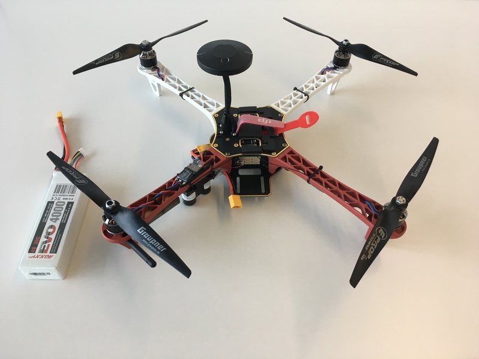
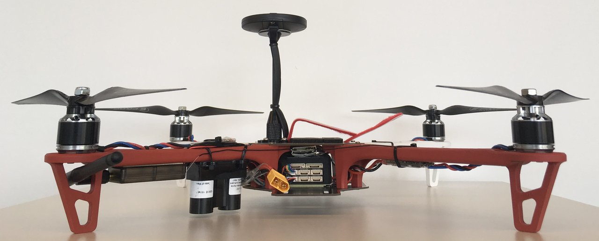
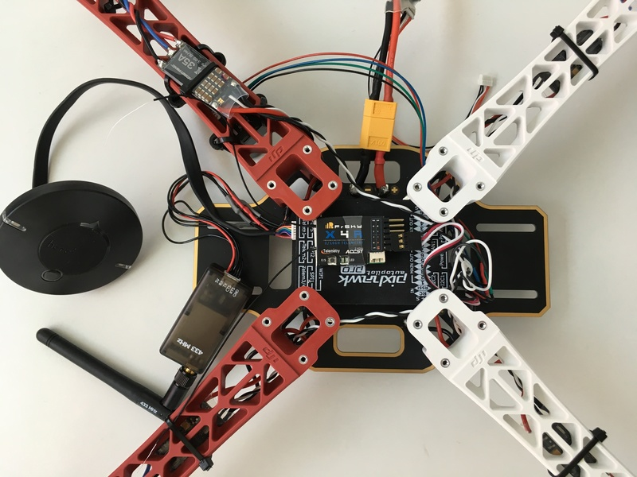
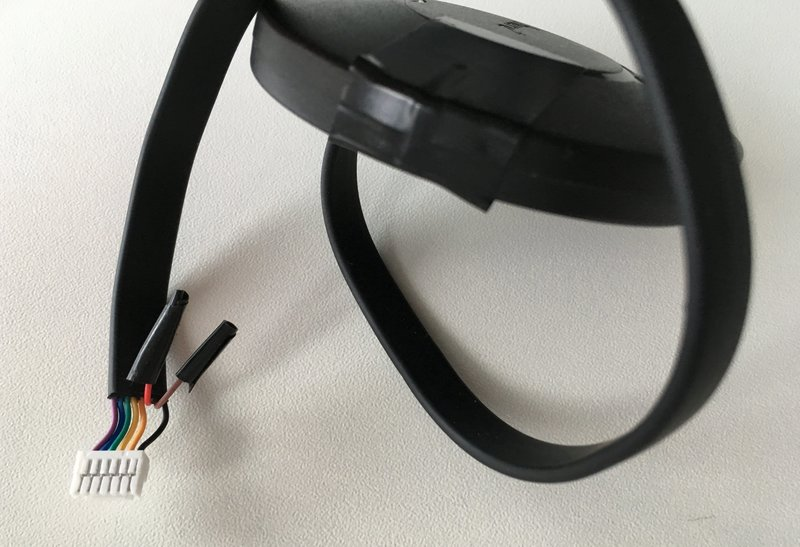

# DJI Flamewheel 450 with distance sensor and RTK GPS
-------------------------

## Parts List
* Autopilot:        [Pixhawk 3 Pro](..//flight_controller/pixhawk3_pro.md)
* Frame:            DJI Flamewheel 450
* Motors:           3DR Iris Plus 950kv repranded T-Motors MN2213
* ESCs:             Hobbywing XRotor 35A Micro 3-6S BLHeli
* Blades:           Graupner 10"x5" (You need to print [these adapters](https://drive.google.com/open?id=0B2piootk_fIKMWhIVzVPWEFGLU0) to be M6 compatible) <!--TODO-->
* Distance sensor:  Lidar-Lite V3
* GPS:              Here+ RTK GPS
* Telemetry:        3DR Telemetry
* Battery:          Roxxy LiPo - 4S, 4000mAh

In addition we use a FrSky X4R-SB 3/16ch 2.4Ghz receiver and a FrSky Taranis controller. You will also need zip ties, double sided tape, a soldering iron and a 3D printer in case you use the same Blades, for this build. The GPS mast was reused from an Intel Aero.

The Pixhawk 3 Pro can be attached using the double sided tape because the IMU inside is already dampened.

## Wiring and connections

General pinout for the Pixhawk 3 Pro can be found [here](https://pixhawk.drotek.com/en/inputs-outputs.html).

### 3DR Telemetry

The 3DR Telemetry does not come with a JST GH connector which the Pixhawk 3 Pro uses. The pinout remains the same and just the plug needs to be changed. Use the Telem 1 port on the Pixhawk 3 Pro.

| pin | Pixhawk 3 Pro Telem 1 | 3DR Telemetry    |
| --- | --------------------- | ---------------- |
| 1   | VCC                   | VCC              |
| 2   | TX                    | RX               |
| 3   | RX                    | TX               |
| 4   | CTS                   | CTS              |
| 5   | RTS                   | RTS              |
| 6   | GND                   | GND              |

### Lidar-Lite V3

The pinout for the Lidar Lite V3 and the Pixhawk 3 Pro I2C 1 port is as follows.

| pin | Pixhawk 3 Pro I2C 1 | Lidar Lite V3    |
| --- | ------------------- | ---------------- |
| 1   | VCC                 | VCC              |
| 2   | SCL                 | - (Power enable) |
| 3   | SDA                 | - (Mode control) |
| 4   | GND                 | SCL              |
| 5   | -                   | SDA              |
| 6   | -                   | GND              |

### Here+ RTK GPS

The Here+ GPS comes with an 8 pin connector suited for the Pixhawk 2. In order to
use it with the Pixhawk 3 Pro (or a Pixracer), a 6 pin connector has to be used
and pin 6 and 7 are not needed (see below). The additional pins are for the
safety button and can be attached as well if needed.
More information on the pinout can be found in [this document](http://www.hex.aero/wp-content/uploads/2016/07/DRS_Pixhawk-2-17th-march-2016.pdf),
page 17.

| pin | Here+ GPS     | pin | Pixhawk 3 Pro GPS |
| --- | ------------- | --- | ----------------- |
| 1   | VCC_5V        | 1   | VCC               |
| 2   | GPS_RX        | 2   | GPS_TX            |
| 3   | GPS_TX        | 3   | GPS_RX            |
| 4   | SCL           | 4   | SCL               |
| 5   | SDA           | 5   | SDA               |
| 6   | BUTTON        | -   | -                 |
| 7   | BUTTON_LED    | -   | -                 |
| 8   | GND           | 6   | GND               |

## Parameters

General documentation on how to setup your quad in QGC can be found [here](https://docs.qgroundcontrol.com/en/).

### Airframe

Select the airframe `DJI Flame Wheel 450` in `QGC -> Airframe -> Quadrotor x`.

### Lidar-Lite

To enable the Lidar-Lite V3 (connected via I2C), the parameter `SENS_EN_LL40LS` has to be set to `2`. This can be done using the NuttX shell and the command `param set SENS_EN_LL40LS 2`. See [here](../debug/sensor_uorb_topic_debugging.md) how to get a shell.

### RTK GPS

RTK GPS is plug and play. For more instructions see [here](https://docs.px4.io/en/advanced_features/rtk-gps.html).
