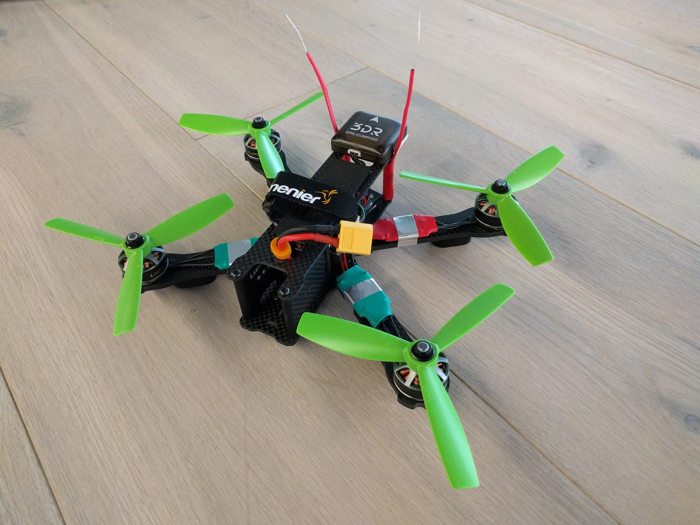
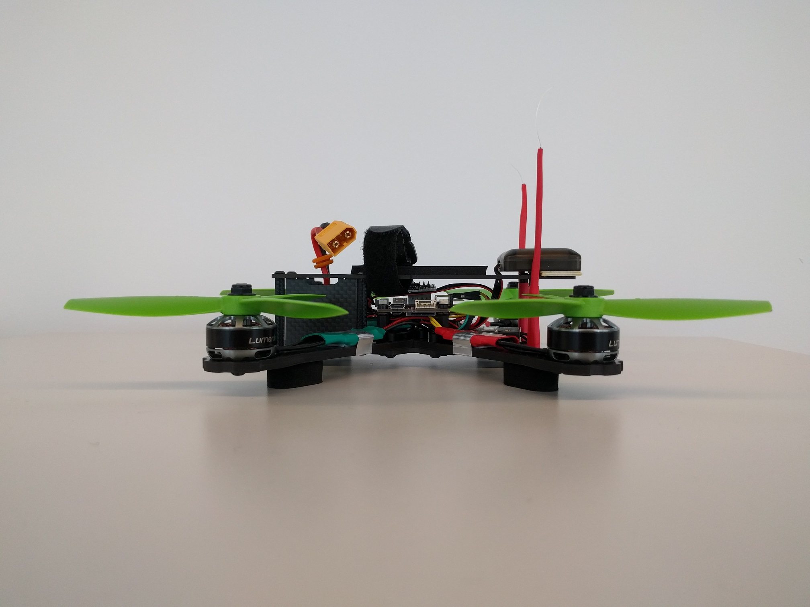
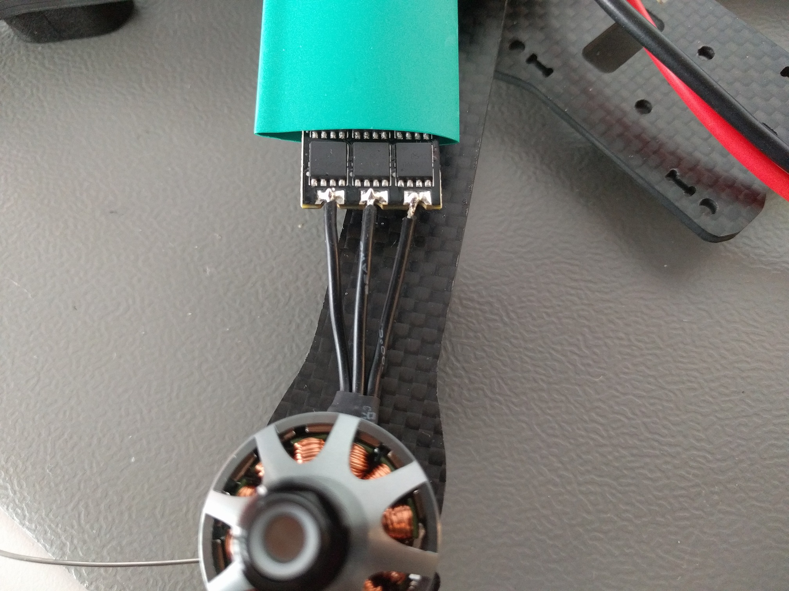
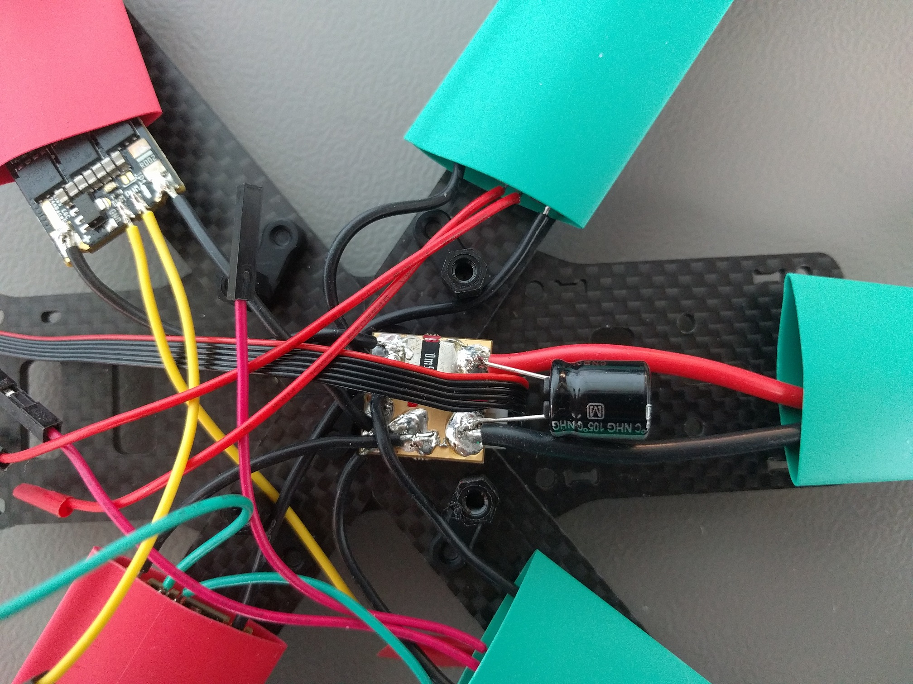
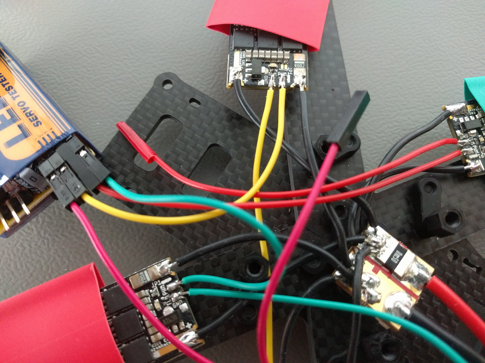
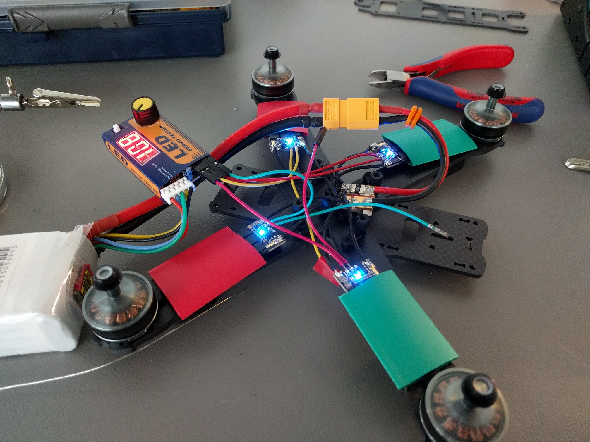

# QAV-R 5" KISS ESC Racer

## Parts List

* Autopilot:        [Pixracer](/flight_controller/pixracer.md) from AUAV including Power- and WiFi-module
* Frame:            [Lumenier QAV-R 5"](http://www.getfpv.com/qav-r-fpv-racing-quadcopter-5.html)
* Motors:           [Lumenier RX2206-11 2350KV](http://www.getfpv.com/lumenier-rx2206-11-2350kv-motor.html)
* ESCs:             [KISS 24A Race Edition](http://www.getfpv.com/kiss-24a-esc-race-edition-32bit-brushless-motor-ctrl.html)
* Props:            HQProp 5x4.5x3 [CW](http://www.getfpv.com/hqprop-5x4-5x3rg-cw-propeller-3-blade-2-pack-green-nylon-glass-fiber.html) [CCW](http://www.getfpv.com/hqprop-5x4-5x3g-ccw-propeller-3-blade-2-pack-green-nylon-glass-fiber.html)
* GPS:              M8N taken from a [3DR Pixhawk Mini set](https://store.3dr.com/products/3dr-pixhawk) and rewired
* Battery:          [TATTU 1800mAh 4s 75c Lipo](http://www.getfpv.com/tattu-1800mah-4s-75c-lipo-battery.html)
* RC Receiver:      [FrSky X4R-SB](http://www.getfpv.com/frsky-x4r-sb-3-16-channel-receiver-w-sbus.html)
* Remote Control:   [FrSky Taranis](http://www.getfpv.com/frsky-taranis-x9d-plus-2-4ghz-accst-radio-w-soft-case-mode-2.html)

Todo O-rings

## Assembling the Basic Frame

I assembled the basic center plate and the arms like in this video between 09:25 and 13:26:
https://youtu.be/7SIpJccXZjM?t=565

I mounted the four motors to the frame with the cables coming out towards the center of the frame. I used two of the longer motor screws that come with the frame for each motor and put them in the two holes which are further apart.

## Building the Power Train

The KISS ESCs are known for their good performance but they also come with two disadvantages:
- The software they use is not open source (unlike BLHeli)
- There exists to my knowledge no hardware package with presoldered wires and or plugs

This means we need to solder at least 6 joints on every ESC but it's totally worth it.

> **Tip** Always tin both sides you want to connect with solder before actually soldering them together.

> **Tip** Make sure that you use a propriate cable gauge for the power connections that transport the high current all the way from the battery to the motors. All signal cables can be very thin in comparison.

> **Tip** Put heat shrink on the cables before you start soldering! Heatshrinking the ESCs and the power module after a successful function test will protect them from dirt, moisure and physical damage

### Motors
First I cut all three motor cables to directly fit when the ESCs are mounted on the arms shifted towards the center but still let enough slack to allow easy placement of the parts and not produce any tension on the cables. Then I soldered them in the order they come out of the motor to the output contacts of the ESCs which are oriented with the switching MOS-FETs facing updwards to get good air cooling during flight. Choosing this cable order resulted in all the motors spinning counter-clockwise in my tests and I switched where necessary the direction of rotation by bridging the dedicated [JP1 solder jumper](https://1.bp.blogspot.com/-JZoWC1LjLis/VtMP6XdU9AI/AAAAAAAAAiU/4dygNp0hpwc/s640/KISS-ESC-2-5S-24A-race-edition-32bit-brushless-motor-ctrl.jpg) to conform the [Quadrotor x configuration](/en/airframes/airframe_reference.html#quadrotor-x).

### Power Module
First I soldered the XT60 connector which comes with the frame to the labeled bettery side of the [ACSP5 power module](http://fs5.directupload.net/images/160304/a72l2mbz.jpg) that was shipped with the pixracer and added the elco capacitor delivered with the power module with the correct polarity to the same side.

Now comes the tricky part. I soldered all four ESC voltage source + and - ports to the corresponding pad on the labeled ESC output side of the power module. Make sure to not have any cold solder joint here because the quad will not end up well with a loose connection in flight. Using the additional power distribution board of the frame would make the job a lot easier but also takes too much space on such a small frame...

### Signal Cables

I used thin cables with a standardized pin header connector which were cut in half for the ESC signal because this will allow easy plugging on the pixracer pins later on. Only the labeled `PWM` port on the [KISS ESCs](https://1.bp.blogspot.com/-0huvLXoOygM/VtMNAOGkE5I/AAAAAAAAAiA/eNNuuySFeRY/s640/KISS-ESC-2-5S-24A-race-edition-32bit-brushless-motor-ctrl.jpg) is necessary for flying. They will be connected to the correct motor signal output of the pixracer. The `TLM` port is for ESC telemetry and I soldered them on for future use as the needed protocol is not currently supported by PX4.

I tested all ESC motor pairs and their rotation directions using a cheap PWM servo tester before proceeding further.

