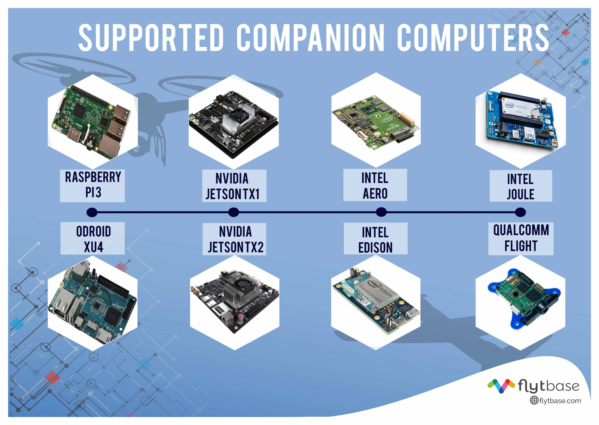
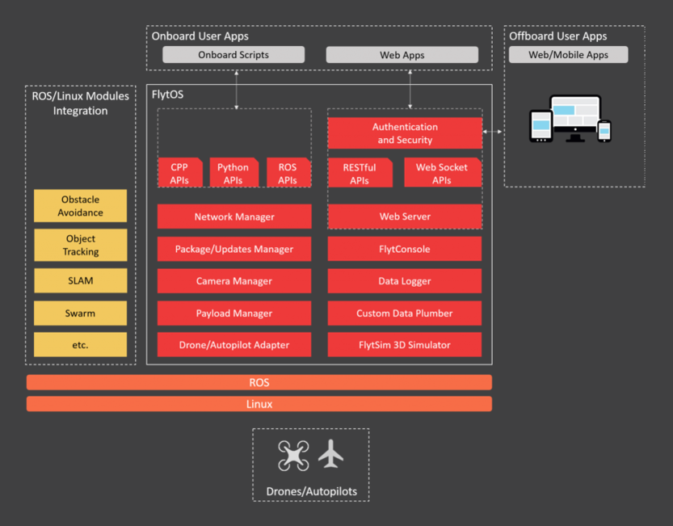

# FlytOS 

[FlytOS](https://flytbase.com) is a software framework which provides Drone APIs and SDKs for building high-level 
drone applications such as aerial delivery, precision agriculture, surveys, photography, industrial inspections and disaster
management. It is designed to enable drone-developers build advanced drone applications using its open APIs.

FlytOS is based on Linux and ROS (Robot Operating System), making it an ideal platform for building commercial as well as 
research orientated drone applications. It supports a wide range of hardware options such as *Raspberry Pi 3, Odroid XU4, 
Nvidia TX1, Intel Edison, Intel Aero and FlytPOD*. It uses MAVLink to communicate with the autopilot, and exposes high level
FlytAPIs in *ROS, CPP, Python, REST and Websocket*.

This makes it easy to build high-level applications using computer-vision, machine-learning, cloud-connectivity and enables
developers to create their custom user-interfaces on web/mobile devices of their choice. FlytOS also has modules to manage 
payloads, security and updates. The modular design of FlytOS allows for integration with external ROS/Linux libraries and 
custom data plumbing between onboard and offboard apps. FlytOS aims to provide a standard language for the drone application
developers to talk to their drones.

https://www.youtube.com/watch?v=CZFVWDN5Gcc

   

## Developer Tools

FlytOS provides several developer tools, such as FlytSDK and FlytSIM, to further help developers quickly get started.

[FlytSDK](http://docs.flytbase.com/docs/FlytOS/Developers/BuildingCustomApps.html#remote-apps) is the software development 
kit for web and android developers. A number of [sample applications](https://github.com/flytbase/flytsamples) are 
available on github, that can be used as templates/reference to build custom applications.

[FlytSIM](http://docs.flytbase.com/docs/FlytOS/Developers/Flytsim.html) is a ROS/Gazebo based simulator to test applications
built using FlytAPIs. This allows developers to build and test drone applications, safely and efficiently, minimizing the 
requirement for flight-tests.

## Supported Companion Computers

* Raspberry Pi3 [[installation instructions]](http://docs.flytbase.com/docs/FlytOS/GettingStarted/RaspiGuide.html)
* Odroid-XU4 [[installation instructions]](http://docs.flytbase.com/docs/FlytOS/GettingStarted/OdroidGuide.html)
* Nvidia-TX1 [[installation instructions]](http://docs.flytbase.com/docs/FlytOS/GettingStarted/TX1Guide.html)
* FlytPOD [[installation instructions]](http://docs.flytbase.com/docs/FlytOS/GettingStarted/FlytPODGuide.html)
* Intel Edison [[installation instructions]](http://docs.flytbase.com/docs/FlytOS/GettingStarted/EdisonGuide.html)
* Intel Aero [[installation instructions]](http://docs.flytbase.com/docs/FlytOS/GettingStarted/AeroGuide.html)
* Intel Joule (*coming soon*)
* Qualcomm Snapdragon Flight (*coming soon*)
* Nvidia-TX2 (*coming soon*)

## Supported Languages

FlytOS offers Drone APIs for building applications with onboard as well as remote components. These drone APIs not only
provide you, the control over vehicle's navigation, payloads (gimbal, camera, etc.) but also has few inbuilt AI/ML modules
such as object detection and tracking, obstacle detection etc.

### Onboard APIs

These are APIs available onboard the companion computer and can be used for developing domain specific intelligence and business logic. Typical candidates are tasks requiring high reliability, low latency and relatively low processing power as offered by the onboard computers.

* [C++](http://api.flytbase.com/?cpp#)
* [Python](http://api.flytbase.com/?python#)
* [ROSCpp](http://api.flytbase.com/?cpp--ros#introduction)
* [ROSPy](http://api.flytbase.com/?python--ros#introduction)

Click on corresponding links to know more about building custom apps in 
[cpp](http://docs.flytbase.com/docs/FlytOS/Developers/BuildingCustomApps/OnboardCPP.html#write-onboard-cpp) and
[python](http://docs.flytbase.com/docs/FlytOS/Developers/BuildingCustomApps/OnboardPython.html#write-onboard-python).

### Remote APIs

These are APIs for building web/mobile apps for remote devices and are helpful for creating custom User Interfaces specific 
to the application as well as for integrating any off-board processing. They are available as [RESTful](http://api.flytbase.com/?javascript--REST#introduction) and 
[WebSocket](http://api.flytbase.com/?javascript--Websocket#introduction) requests, where typically REST is used for sending commands
to the drone and WebSocket for getting continual data stream (telemetry). Click one of the below links, to know more about
building custom apps for web and mobile.

* [JS](http://docs.flytbase.com/docs/FlytOS/Developers/BuildingCustomApps/RemoteWeb.html#write-remote-web)
* [Java(Android)](http://docs.flytbase.com/docs/FlytOS/Developers/BuildingCustomApps/RemoteMobile.html#write-remote-mobile)

## Sample Applications

We have made available, a few sample apps to help you get started with drone application development. You can find them on
github at [FlytSamples github repository](https://github.com/flytbase/flytsamples). These sample apps are written in all of
the above supported_languages. Web/android developers could begin with a simple 
[Joystick App](https://github.com/flytbase/flytsamples/tree/master/Mobile-Apps/Java-Apps/Joystick). A couple of 
easy-to-understand [CPP/Python/ROS based apps](https://github.com/flytbase/flytsamples/tree/master/CPP-Python-ROS-Apps) are also available.

### Vision-based Object-Tracking and Following

FlytOS comes bundled with Vision-based Object-Tracking and Following module. To learn more about it, checkout 
[this blog](http://blogs.flytbase.com/computer-vision-for-drones-part-2/).

https://www.youtube.com/watch?v=bom1VEcxwEA

### Deep Learning with Nvidia

Using FlytOS on Nvidia-TX1/Nvidia-TX2 opens up possible integration of deep learning applications with drone. To begin with,
you could install *caffe*, a popular deep learning framework by follwing our [deep learning tutorial](https://goo.gl/HwNMuY).
We also have a sample [object classification and tracking](https://github.com/flytbase/flytos_tx1) example using caffe. [Read more](https://goo.gl/ZReoJ7).

https://www.youtube.com/watch?v=wSFYOw4VIYY

### GPS based Object Following

This android app would enable you to control your drone to follow you wherever you go based on your device's GPS location. 
Take a look at the [GPS Follow Me code](https://github.com/flytbase/flytsamples/tree/master/Mobile-Apps/Java-Apps/Follow_me), 
install it in your mobile and see FlytOS in action.

### SONAR based obstacle detection

You could enable your drone with a minimalistic obstacle detection by using SONAR, capturing its data, integrating it with 
FlytOS and eventually maneuvering the drone through an obstacle course. We have provided a [sample implementation](https://github.com/flytbase/flytsamples/tree/master/Sample-Projects/sonar_obstacle_sensor), 
of using Arduino to trigger SONAR and then transmit the captured data to a companion computer. Using this data, you could
write a simple onboard ROS/cpp/python app navigating the drone using FlytAPIs.

## Important Links

* [FlytOS Download](https://my.flytbase.com/downloads)
* [FlytOS Documentation](http://docs.flytbase.com/docs/FlytOS/GettingStarted/FlytOSInstallationGuide.html)
* [FlytAPI Reference](http://api.flytbase.com)
* [Sample Applications](https://github.com/flytbase/flytsamples)
* [Discussion Forum](http://forums.flytbase.com)
* [Gitter Channel](https://gitter.im/FlytBASE/FlytOS)
* [Facebook Community](https://goo.gl/MWlexy)
* [Youtube Channel](https://goo.gl/DzfW1V)

Mail us at support@flytbase.com for dedicated support and visit https://flytbase.com for more information.
 
