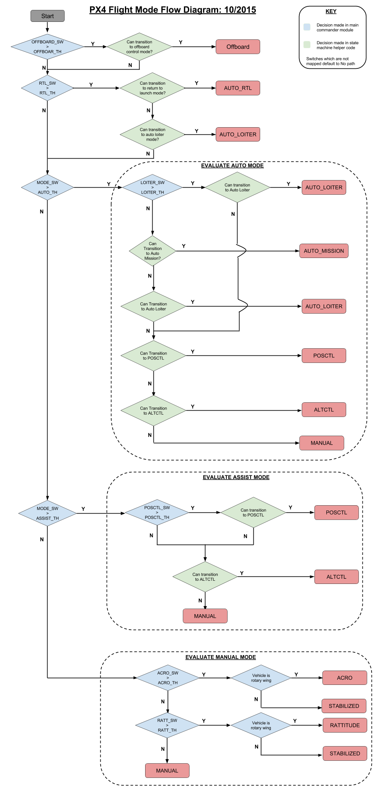

# Flight Modes

**Flight Modes** define the state of the system at any given time.  The user transitions between flight modes via switches on the remote control or the [ground control station](../qgc/README.md), and are loosely grouped according to their level of control of the vehicle by the system vs. the user: "manual" modes, where the controller is essentially a pass-through from the user's remote control to the vehicle's actuators; "assisted" modes, where the system's outputs are coordinated with the user's commands; and, "auto" modes, where the controller requires little to no user input whatsoever.

Not all flight modes are available on all vehicle types, and some modes behave differently according to vehicle type as described below. Finally, some flight modes make sense only under specific pre-flight and in-flight conditions (GPS lock, airspeed sensor, and/or vehicle attitude sensing along an axis); the system will not allow transitions to those modes until such conditions are met.

## Flight Mode Quick Summary

  * Manual flight modes
    * **Fixed wing aircraft/ rovers / boats:** 
        * **MANUAL:** (flight mode) The pilot's control inputs are passed directly to the output mixer.
        * **STABILIZED:** (flight mode) The pilot's inputs are passed as roll and pitch *angle* commands and a manual yaw command.
    * **Multirotors:**
        * **ACRO:** (flight mode) The pilot's inputs are passed as roll, pitch, and yaw *rate* commands to the autopilot.  This allows the multirotor to become completely inverted.  Throttle is passed directly to the output mixer
        * **RATTITUDE** (flight mode) The pilot's inputs are passed as roll, pitch, and yaw *rate* commands to the autopilot if they are greater than the mode's threshold.  If not the inputs are passed as roll and pitch  *angle* commands and a yaw *rate* command.  Throttle is passed directly to the output mixer.
        * **STABILIZED** (flight mode) The pilot's inputs are passed as roll and pitch *angle* commands and a yaw *rate* command.  Throttle is passed directly to the output mixer.
  * ASSISTED flight modes
    * **ALTCTL** (flight mode)
      * **Fixed wing aircraft:** When the roll, pitch and yaw inputs (RPY) are all centered (less than some specified deadband range) the aircraft will return to straight and level flight and keep its current altitude. It will drift with the wind.
      * **Multirotors:** Roll, pitch and yaw inputs are as in MANUAL mode. Throttle inputs indicate climb or sink at a predetermined maximum rate. Throttle has large deadzone.
    * **POSCTL** (flight mode)
      * **Fixed wing aircraft:** Neutral inputs give level, flight and it will crab against the wind if needed to maintain a straight line.
      * **Multirotors** Roll controls left-right speed, pitch controls front-back speed over ground. When roll and pitch are all centered (inside deadzone) the multirotor will hold position. Yaw controls yaw rate as in MANUAL mode. Throttle controls climb/descent rate as in ALTCTL mode.
  * AUTO flight modes
    * **AUTO_LOITER** (flight mode)
        * **Fixed wing aircraft:** The aircraft loiters around the current position at the current altitude (or possibly slightly above the current altitude, good for 'I'm losing it'). 
        * **Multirotors:**  The multirotor hovers / loiters at the current position and altitude.
    * **AUTO_RTL** (flight mode)
        * **Fixed wing aircraft:** The aircraft returns to the home position and loiters in a circle above the home position. 
        * **Multirotors:** The multirotor returns in a straight line on the current altitude (if higher than the home position + loiter altitude) or on the loiter altitude (if higher than the current altitude), then lands automatically.
    * **AUTO_MISSION** (flight mode)
        * **All system types:** The aircraft obeys the programmed mission sent by the ground control station (GCS). If no mission received, aircraft will LOITER at current position instead.
  * **_OFFBOARD_** (flight mode)
    In this mode the position, velocity or attitude reference / target / setpoint is provided by a companion computer connected via serial cable and MAVLink. The offboard setpoint can be provided by APIs like [MAVROS](https://github.com/mavlink/mavros) or [Dronekit](http://dronekit.io).

## Flight Mode Evaluation Diagram

