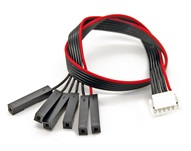
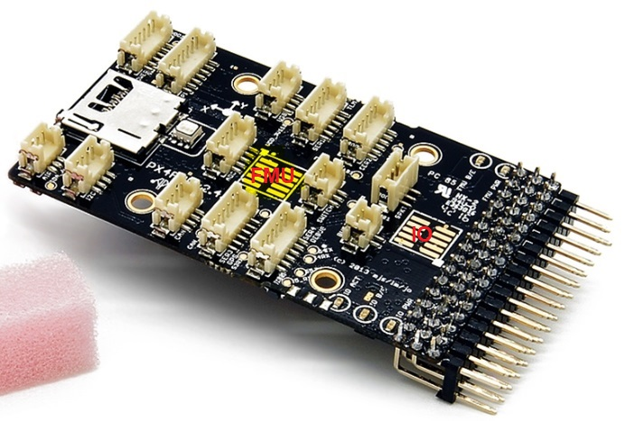

# Hardware Debug Interfaces (Debug Port)

PX4 runs on hardware that typically provides at least two interfaces for on-target (hardware) debugging:
- **ARM Serial Wire Debug (SWD):** This is an ARM-processor alternative to the JTAG debug port, with lower pin count.
  It is used for debugging firmware, and can also be used to add a new bootloader and/or firmware on a completely empty board (that does not have the USB bootloader installed).
- **[System Console](../debug/system_console.md) (UART)**: The system console provides low-level access to the system, debug output and analysis of the system boot process (other consoles are available from telemetry/USB etc, but these do not provide such early access to boot sequence information).

On Pixhawk-series boards these interfaces are usually exposed through a single port. (though older boards may separate them).
On older Pixhawk boards, and on other boards, these may be separate.

> **Tip** Some boards may include additional interfaces.
  For example, Pixhawk FMUv5 will support Google ARM ETM Trace through a separate interface.
  
This topic explains how to connect the system console, SWD interface, and other interfaces on different boards (actually performing the debugging is then covered in the associated [debugging topics](#debugging_topics)).

## Debug Interface Overview

### System Console

The PX4 *System Console* is simply a UART that has specifically been configured for this purpose (in NuttX) on a particular board.
You will need to connect the TX, RX and GND to your computer, either via an FTDI cable (converts UART TX/RX to USB serial), [Dronecode Probe](#dronecode_probe), or similar adapter.

### ARM Serial Wire Debug (SWD)

SWD is a physical interface for JTAG debugging that has low-pin count, and which has been designed for ARM-processors.

SWD is a low pin-count physical interface for JTAG debugging on ARM-processors.
Not all pins are required, and not all of them are available on all PX4 boards.

SWD/PX4 requires the following pins (these should be connected on the corresponding pins of the flight controller board and SWD/JTAG device).

Pin | Signal Type | Description
--- | --- | ---
VTref | Input | Target reference voltage. Used to check if the target has power, to create the logic-level reference for the input comparators and to control the output logic levels to the target. It is normally fed from Vdd of the target board and must not have a series resistor.
SWDIO | I/O | Single bi-directional data pin. A pull-up resistor is required. ARM recommends 100 kOhms.
SWCLK | Output | Clock signal to target CPU. It is recommended that this pin is pulled to a defined state on the target board. Typically connected to TCK of the target CPU.
GND | - | Ground pin. Should be connected to GND in the target system.

These pins are also supported on boards where they are present (e.g. on FMUv5x).

Pin | Signal Type | Description
--- | --- | ---
SWO | Input | Serial Wire Output trace port (Optional, not required for SWD communication.)
nRESET | I/O | Target CPU reset signal. Typically connected to the RESET pin of the target CPU, which is typically called `nRST`.
TRACECLK | Input | Input trace clock. Trace clock = 1/2 CPU clock.
TRACEDATA[0] | Input | Input Trace data pin 0 (called TRACED0 in Pixhawk FMUv5x)

>  **Note** The information above is reproduced from [J-Link / J-Trace User Guide: UM08001 > 18.1.2 Pinout for SW Mode](https://www.segger.com/downloads/jlink/UM08001) (Software Version: 6.54).
  There is additional information about SWD in: [ARM® Debug Interface Architecture Specification: ADIv5.0 to ADIv5.2](https://static.docs.arm.com/ihi0031/d/debug_interface_v5_2_architecture_specification_IHI0031D.pdf)

## Adapters and Wiring {#adapters_and_wiring}

Where possible, we highly recommend that you use adapter boards rather than custom cables for connecting to SWD/JTAG debuggers and computers.
This reduces the risk or poor wiring contributing to debugging problems, and has the benefit that adapters usually provide a common interface for connecting to multiple popular flight controller boards.

The following section outlines some of the available adaptors, and the boards you might use with them.

### Dronecode Probe (Adapter) {#dronecode_probe}

[Dronecode Probe](https://kb.zubax.com/display/MAINKB/Dronecode+Probe+documentation) is a generic JTAG/SWD + UART console adapter compatible with most ARM Cortex based designs and in particular with the hardware maintained by the Dronecode project.

The probe's USB interface exposes two separate virtual serial port interfaces: one for connecting to the System Console (UART) and the other for an embedded GDB server (SWD interface).
The probe provides a DCD-M connector cable for attaching to the [Pixhawk Debug port](https://pixhawk.org/pixhawk-connector-standard/#dronecode_debug) (a 6-pos *JST SM06B*), which is used on many Pixhawk flight controllers.

The DCD-M connector can be attached to `DEBUG` port(s) on the following boards:
  - [mRo Pixracer](https://docs.px4.io/master/en/flight_controller/pixracer.html#debug-port-jst-sm06b-connector) (FMUv4)
  - [Drotek Pixhawk v3](https://drotek.gitbook.io/pixhawk-3-pro/hardware/inputs-outputs) (FMUv4pro)
  - [Holybro Pixhawk 4](https://docs.px4.io/master/en/flight_controller/pixhawk4.html#debug-port) (FMUv5)
  - [Holybro Pixhawk 4 mini](https://docs.px4.io/master/en/flight_controller/pixhawk4_mini.html#debug-port) (FMUv5)
  - [CUAV V5](https://docs.px4.io/master/en/flight_controller/cuav_v5.html#debug-port) (FMUv5)
  - [CUAV V5+](https://docs.px4.io/master/en/flight_controller/cuav_v5_plus.html#debug-port) (FMUv5)
  - [CUAV V5 nano](https://docs.px4.io/master/en/flight_controller/cuav_v5_nano.html#debug_port) (FMUv5)

The probe also provides a *6-pos DF13*m which can be attached to the Pixhawk 1 SERIAL4/5 port to debug the System Console (Not SWD).

> **Note** The *Dronecode Probe* is based on the [Black Magic Probe](#black_magic_probe).
  
### Black Magic Probe {#black_magic_probe}

The [Black Magic Probe](https://github.com/blacksphere/blackmagic/wiki) offers similar SWD debug-functionality to the [Dronecode probe](#dronecode_probe).
However this is not designed with Pixhawk standards in mind, so additional adapters or cabling will be required to interface with the SWD port (and to separately expose the *System Console*).

Black Magic Probe adapters:
- [Drone Code Debug Adapter](https://1bitsquared.com/products/drone-code-debug-adapter) (1 BIT SQUARED).

### NXP Debug Adapter {#nxp_dapter}

NXP provide a debug adaptor for the [Hovergames RDDRONE-FMUK66](#fmuk66) (see below).
This connects to the RDDRONE-FMUK66 using a 7-pin JST-GH connector and splits out an SWD cable and UART cable (for the system console).

This can directly be used with:
* [Hovergames RDDRONE-FMUK66](#fmuk66)

### Custom Cables

You can also create or build your own cables for the board you want to use.

> **Note** If you only want to use the console, or only SWD, there is nothing to stop you just connecting to the relevant pins for each interface.

## Pixhawk Series {#pixhawk_series}

[Pixhawk-series](https://docs.px4.io/master/en/flight_controller/pixhawk_series.html) boards from FMUv3 provide access to both SWD and System Console interfaces through a single FMU **DEBUG** port.
This can be used to load new bootloader/FMU Firmware and perform on-hardware SWD debugging on the FMU, or to access the System Console.

The **DEBUG** has changed and standardised across versions (so no single connector works on all boards)
- [Pixhawk debug port](https://pixhawk.org/pixhawk-connector-standard/#dronecode_debug) (JST SM06B connector).

> **Note** Many boards may also expose a separate DEBUG port for the IO board.
  This may be used to load a new bootloader or IO firmware.
  It can also be used to debug IO (this is rare).

### FMUv3 Pro

FMUv3 Pro (and specifically the ) specifies the [Pixhawk debug port](https://pixhawk.org/pixhawk-connector-standard/#dronecode_debug) (JST SM06B connector).

You can therefore connect to it using a [Dronecode probe](#dronecode_probe) or other cabling or adapter that provides access to the interfaces.

### FMUv3 Pro FMUv4/FMUv5

FMUv4 and FMUv5 specify the [Pixhawk debug port](https://pixhawk.org/pixhawk-connector-standard/#dronecode_debug).
You can therefore connect to it using a [Dronecode probe](#dronecode_probe) or other cabling or adapter that provides access to the interfaces.

Applicable boards include:
- Drotek Pixhawk 3 Pro (FMUv3pro)
- [mRo Pixracer](http://docs.px4.io/master/en/flight_controller/pixracer.html#pinouts) (FMUv4)

The debug port (JST SM06B connector) is documented for each board, and has the following pinout:

Pin | Signal | Volt
--- | --- | ---
1 (red) | VCC TARGET SHIFT | +3.3V
2 (blk) | CONSOLE TX (OUT) | +3.3V
3 (blk) | CONSOLE RX (IN) | +3.3V
4 (blk) | SWDIO | +3.3V
5 (blk) | SWCLK | +3.3V
6 (blk) | GND | GND

### FMUv5X

FMUv5X will have a new debug port definition, which uses a [10-pin JST SUR](https://www.digikey.com/product-detail/en/jst-sales-america-inc/A10SUR10SUR32W152B/455-4015-ND).

The new pinout adds additional SWD pins: SWO, nRST. It also adds TRACECLK, TRACED0 (Pins 7 and 8) which are are GPIOS to gate timing or 1 wire trace (Google ARM ETM).

The FMUv5x debug port pinout is:

Pin | Signal | Volt
--- | --- | ---
1 (red) | FMU VDD | +3.3V
2 (blk) | CONSOLE TX (OUT) | +3.3V
3 (blk) | CONSOLE RX (IN) | +3.3V
4 (blk) | SWDIO | +3.3V
5 (blk) | SWCLK | +3.3V
6 (blk) | SWO | +3.3V
7 (blk) | TRACECLK | +3.3V
8 (blk) | TRACED0 | +3.3V
9 (blk) | nRST | +3.3V
10 (blk) | GND | GND

> **Note** This board will have an additional/separate 8-pin JST SUR for ARM ETM TRACE).

## Hex Cube

TBD

<!-- 

Cube debug port information can be found here: [Debug ports](http://docs.px4.io/master/en/flight_controller/pixhawk-2.html#debug-ports).

If pulled apart the Cube has a 6 pin JST SUR connector (marked as J10) for both FMU and IO debugging.

-->

## FMUv2

FMUv2-based boards provide separate ports for accessing System Console and SWD interface.
- The System Console is accessed through the `SERIAL5 pins` (on the `SERIAL4/5` port).
  You can either use the Dronecode probe or an FTDI cable.
- The FMU and IO SWD ports (for JTAG debugging) are usually hidden inside the case.
  - The ports are *ARM 10-Pin JTAG connectors, which have the following pinout (pin 1 is usually indicated by a marker)
   
  - The position of the FMU and IO ports depends on the board.

### 3DR Pixhawk 1 {#pixhawk1}

The [3DR Pixhawk 1](https://docs.px4.io/master/en/flight_controller/pixhawk.html) is accessed as below.

#### System Console via Dronecode Probe

Connect the 6-pos DF13 1:1 cable on the [Dronecode probe](#dronecode_probe) to the SERIAL4/5 port of Pixhawk.

#### System Console via FTDI 3.3V Cable

An [FTDI 3.3V](http://www.digikey.com/product-detail/en/TTL-232R-3V3/768-1015-ND) (Digi-Key) can also be directly connected.

Pixhawk 1/2 | | FTDI | |
--- | --- | --- | ---
1 | +5V (red) |   | N/C
2 | S4 Tx     |   | N/C
3 | S4 Rx     |   | N/C
4 | S5 Tx     | 5 | FTDI RX (yellow)
5 | S5 Rx     | 4 | FTDI TX (orange)
6 | GND       | 1 | FTDI GND (black)

The connector pinout is shown in the figure below.

The complete wiring is shown below.

#### SWD via ARM 10-pin JTAG Connector

The FMU and IO SWD (JTAG) ports are hidden under the cover (which must be removed for hardware debugging).

The ports are ARM 10-pin JTAG connectors, which you will probably have to solder.
The pinout for the ports is shown below (the square marker in the corner above indicates pin 1).

 

## Other Boards

### Kakute F7

UART3 RX and TX are configured for System Console.

There are test points for SWD debugging: TBD.
<!-- Beat ? -->

### Hovergames RDDRONE-FMUK66 {#fmuk66}

The Hovergames RDDRONE-FMUK66 has a similar debug interface to Pixhawk (it supports an additional JTAG pin - nRST) and uses a JST-GH connector). 
The debug interface is documented here: [RDDRONE-FMUK66 Debug interface](https://nxp.gitbook.io/hovergames/rddrone-fmuk66/connectors/debug-interface-dcd-lz)

<!-- what am I seeing here? Ie the jlink and the FC are obvious. 
But what is the orange connector between them, and what is the connector out of the center of them doing? -->

## Debugging Topics {#debugging_topics}

After connecting the DEBUG interfaces, these topics explain how you can then perform on-target debugging:

- [System Console](../debug/system_console.md)
- [MCU Eclipse/J-Link Debugging for PX4](../debug/eclipse_jlink.md)