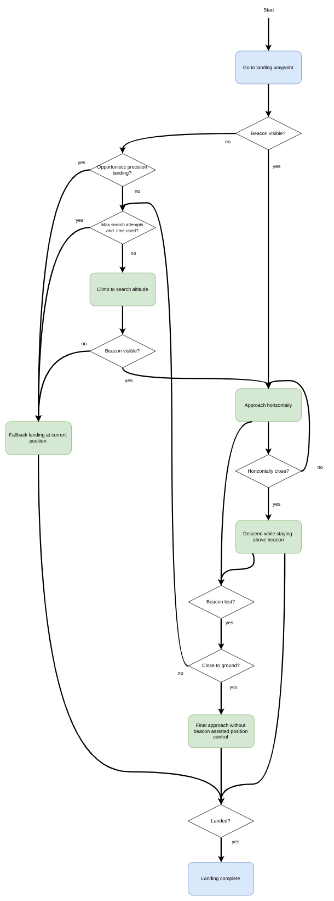

# Precision Landing
This document describes the working principle of the `landing_target_estimator` and the Precision Land flight mode.
For setup and configuration instructions for precision landing with multicopters, refer to the [precision land tutorial](../tutorials/precland.html).

## Landing Target Estimator
The `landing_target_estimator` takes measurements from the `irlock` driver (`irlock_report`s) as well the estimated terrain height (`vehicle_local_position.dist_bottom`) to estimate the beacon's position relative to the vehicle.

The measurements in `irlock_report` contain the tangent of the angles from the image center to the beacon. In other words, the measurements are the x and y components of the vector pointing towards the beacon, where the z component has length 1.
This means that scaling the measurement by the distance from the camera to the beacon results in the vector from the camera to the beacon.
This relative position is then rotated into the north-aligned, level body frame using the vehicle's attitude estimate.
Both x and y components of the relative position measurement are filtered in separate Kalman Filters, which act as simple low-pass filters that also produce a velocity estimate and allow for outlier rejection.

The `landing_target_estimator` publishes the estimated relative position and velocity, whenever a new `irlock_report` is fused into the estimate. Nothing is published if the beacon is not seen or beacon measurements are rejected.
The landing target estimate is published in the `landing_target_pose` message.


## Vehicle state estimate aiding
> **Note** Vehicle state estimate aiding is currently only supported with LPE.

If the beacon is specified to be stationary using the parameter `LTEST_MODE`, the vehicle's position/velocity estimate can be improved with the help of the beacon measurements.
This is done by fusing the beacon's velocity as a measurement of the negative velocity of the vehicle.

## Precision Land controller
A precision landing can be initiated by switching to the Precision land flight mode:
```
commander mode auto:precland
```
In this case, the precision landing is always considered "required".

Alternatively, a precision landing can be initiated as part of a [mission](../tutorials/precland.html#in-a-mission).
In this case, the precision landing is considered "opportunistic" or "required" depending on the parameters in the mission waypoint.

When a precision landing is "required", a search procedure is initiated if the beacon is not visible at the beginning of the precision land procedure. The search procedure consists of climbing to an altitude specified with the `PLD_SRCH_ALT` parameter. If the beacon is still not visible at the search altitude and after a serach timeout (`PLD_SRCH_TOUT`) has passed, a normal landing is initiated at the current position.
As soon as the beacon is visible during the search procedure, the search is stopped and the precision land approach is started.

When a precision landing is "opportunistic", no search procedure is used. If the beacon is visible at the beginning of the precision land procedure, the precision land approach is started. If it is not visible at the beginning, the vehicle falls back to a normal landing at the current position immediately.

### Precision Land Procedure
The precision land procedure consists of three phases.

1. Horizontal approach: The vehicle approaches the beacon horizontally while keeping its current altitude. Once the position of the beacon relative to the vehicle is below a threshold (`PLD_HACC_RAD`), the next phase is entered. If the beacon is lost during this phase (not visible for longer than `PLD_BTOUT`), a search procedure is initiated (during a required precision landing) or the vehicle does a normal landing (during an opportunistic precision landing).
2. Descent over beacon: The vehicle descends, while remaining centered over the beacon. If the beacon is lost during this phase (not visible for longer than `PLD_BTOUT`), a search procedure is initiated (during a required precision landing) or the vehicle does a normal landing (during an opportunistic precision landing).
3. Final approach: When the vehicle is close to the ground (closer than `PLD_FAPPR_ALT`), it descends while remaining centered over the beacon. If the beacon is lost during this phase, the descent is continued independent of the kind of precision landing.

Search procedures are initiated in 1. and 2. a maximum of `PLD_MAX_SRCH` times.


