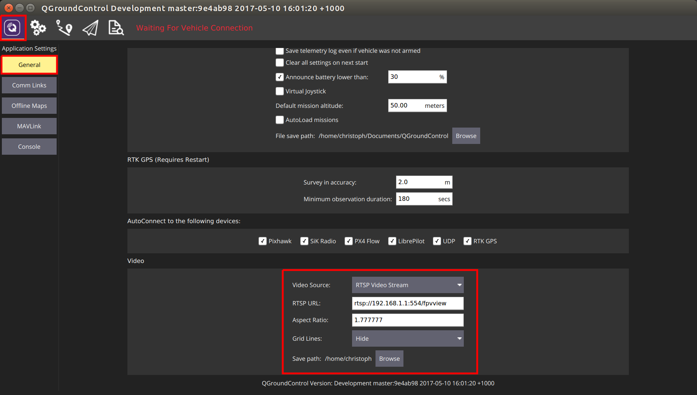

# Using the cameras on the Snapdragon Flight

The Snapdragon Flight board has a downward facing gray-scale camera which can be used for optical flow based position stabilization and a forward facing RGB camera. The [snap_cam](https://github.com/PX4/snap_cam) repo offers a way to run and stream the different cameras and calculate the optical flow.

Besides a camera, optical flow requires a downward facing distance sensor. Here, the use of the TeraRanger One is discussed.

## Optical Flow
The optical flow is computed on the application processor and sent to PX4 through Mavlink.
Clone and compile the [snap_cam](https://github.com/PX4/snap_cam) repo according to the instructions in its readme.

Run the optical flow application as root:
```
optical_flow -n 50 -f 30
```

The optical flow application requires IMU Mavlink messages from PX4. You may have to add an additional Mavlink instance to PX4 by adding the following to your `mainapp.config`:
```
mavlink start -u 14557 -r 1000000 -t 127.0.0.1 -o 14558
mavlink stream -u 14557 -s HIGHRES_IMU -r 250
```

### TeraRanger One setup
To connect the TeraRanger One (TROne) to the Snapdragon Flight, the TROne I2C adapter must be used. The TROne must be flashed with the I2C firmware by the vendor.

The TROne is connected to the Snapdragon Flight through a custom DF13 4-to-6 pin cable. We recommend using connector J15 (next to USB), as all others are already in use (RC, ESCs, GPS). The wiring is as follows:

| 4 pin | <-> | 6 pin |
| -- | -- | -- |
| 1 |  | 1 |
| 2 |  | 6 |
| 3 |  | 4 |
| 4 |  | 5 |

The TROne must be powered with 10 - 20V.

## Camera streaming in QGroundControl

To watch the live stream of either camera `qcamvid` can be used. Run the following command on the Snapdragon Flight to stream the hires camera for 10 minutes without recording with a 720p resolution.
```
qcamvid -c hires -r 720p -s -t 600
```
Use `qcamvid -h` to have a look at all the options.

To watch the live stream in QGroundControl, it has to be built with gstreamer (see [here](https://github.com/mavlink/qgroundcontrol/tree/master/src/VideoStreaming)).

Once installed and conneted to the Snapdragon Flight's network, the following changes have to be made in QGroundControl.


