# Flight Review 101

The plots on [Flight Review](http://logs.px4.io) display a lot of information about a specific flight and the vehicle condition.
It is therefore important to know how to read the data.

The plots are meant to be self-explanatory, but it takes some experience to know what acceptable ranges are or how a plot should look like.
This page is intended to help with that and with identifying common problems.

## General

- **Plot background color**: as some graphs depend on the flight mode, these plots indicate the flight mode as a background color.
  Hovering with the mouse over a plot shows the flight mode labels.
- **VTOL flight mode**: if the vehicle is a VTOL, the lower part shows the VTOL mode (blue for multicopter, yellow for fixed wing and red for transition).
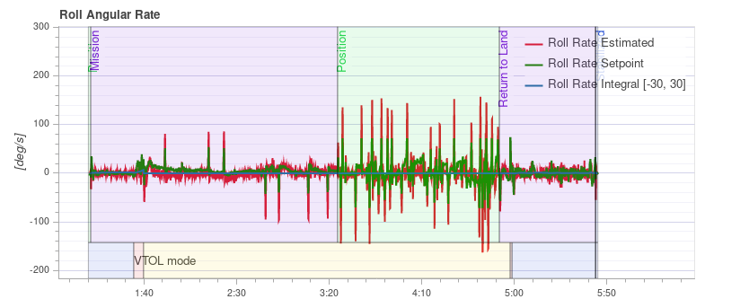

> **Tip** Scrolling on one of the plot axis allows to zoom horizontally or vertically.

## PID Tracking Performance {#tracking}

Each controller (position, velocity, attitude and rate controller) gets a setpoint as input that it tries to follow as close as possible.
Thus the **Estimated** line (red) should closely match with the **Setpoint** (green).
If they do not, in most cases the PID gains of that controller [need to be tuned](https://docs.px4.io/en/config_mc/pid_tuning_guide_multicopter.html) (that page also contains example plots).

> **Tip** Especially for the rate controller it is useful to enable the high-rate logging profile with [SDLOG_PROFILE](../advanced/parameter_reference.md#SDLOG_PROFILE) to get more details when zooming in.

Depending on the flight mode there are no setpoints, for example in Stabilized there are no velocity setpoints.

## Vibration

One of the most common issues for multirotors is vibrations.
High vibration levels can lead to:
- less efficient flight and reduced flight time
- the motors can heat up
- increased material wearout
- inability to tune the vehicle tightly, resulting in degraded flight performance.
- sensor clipping
- position estimation failures and in the worst case fly-aways.

It is therefore important to keep an eye on the vibration levels and improve the setup if needed.
There is a point where vibration levels are clearly too high and generally lower is better, but there is no precise threshold between 'everything is ok' and 'the levels are too high'.
Rather it also depends on the vehicle size, as larger vehicles have higher inertia, allowing for more software filtering (at the same time the vibrations on larger vehicles are of lower frequency).
The following paragraphs and sections provide some guidelines and examples.

Several plots help to check the vibration levels:
- **Actuator Controls FFT**: This shows a frequency plot for the roll, pitch and yaw axis based on the actuator controls signal (the PID output from the rate controller). 
  It helps to identify frequency peaks and configuring the software filters.
  There should only be a single peak at the lowest end up to a few Hz, the rest should be low and flat.

  Note that the y-axis scaling is different for different vehicles, but logs from the same vehicle can be directly compared to each other.
  > **Note** You need to enable the high-rate logging profile to see this plot, see [above](#tracking).
- **Acceleration Power Spectral Density**: this is also a frequency plot in 2D, showing the frequency response of the raw accelerometer data over time (it displays the sum for the x, y and z axis).
  The more yellow an area is, the higher the frequency response at that time and frequency.

  Ideally only the lowest part up to a few Hz is yellow, and the rest is mostly green or blue.
- **Raw Acceleration**: this shows the raw accelerometer measurements for the x, y and z axis. 
  Ideally each line is thin and clearly shows the vehicle's accelerations.

  As a rule of thumb if the z-axis graph is touching the x/y-axis graph during hover or slow flight, the vibration levels are too high. To see that it is best to zoom in a bit to a part where the vehicle is hovering.

### Solutions

Often a source of vibration cannot be identified from a log alone and the vehicle needs to be inspected.
There can be a combination of multiple sources.

Solutions and steps to reduce vibrations include:
- make sure everything is firmly attached on the vehicle (landing gear, GPS mast, etc.)
- use balanced propellers
- make sure to use high-quality components for the propellers, motors, ESC and airframe.
  Each of these components can make a big difference.
- use a vibration-isolation method to mount the autopilot.
- as a *last* measure, adjust the software filters (see [here](https://docs.px4.io/en/config_mc/racer_setup.html#filters)).
  It is better to reduce the source of vibrations, rather than filtering them out in software.

<!-- TODO: write a separate vibration setup page in more depth, move some of this there and link to it from here -->

### Examples

#### Problems with Vibrations

In this log the vibration levels are too high, apparent in the Raw Acceleration plot - the graph of the z-axis overlaps with the x/y-axis graph:
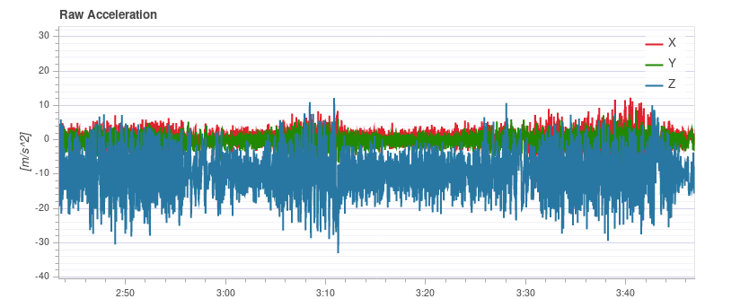
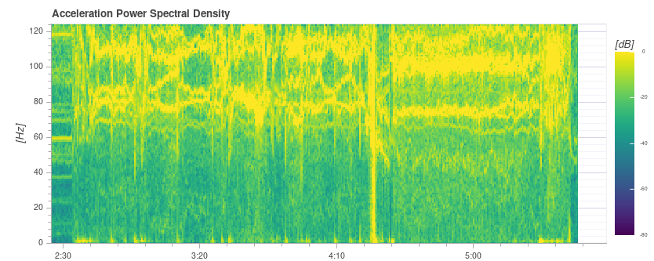

---

The vibration levels of the next example are even higher. The Spectral Density plot is almost completely yellow.

> **Warning** You should not fly with such high vibration levels.

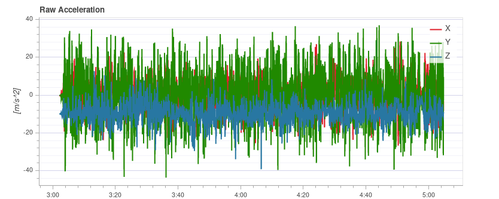
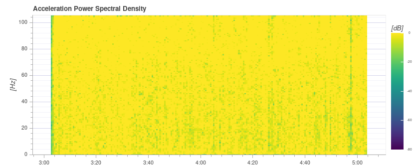

---

This example shows a peak in frequency close to 50 Hz. 
It is clearly visible in the FFT plot and the Spectral Density plot.
In that case the cause was a landing gear that had a bit of play.
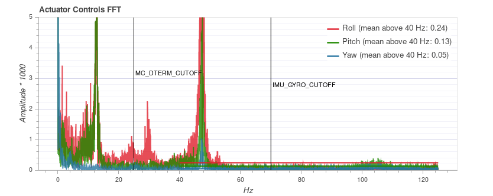
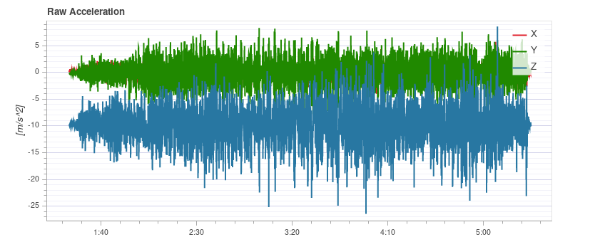
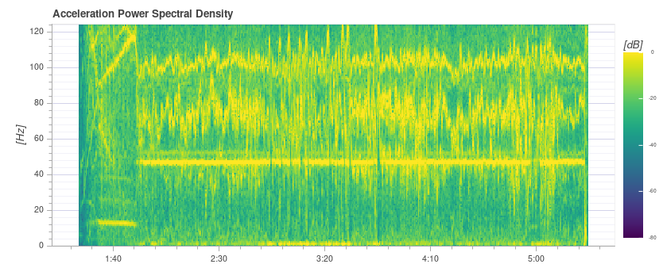

#### No Problems with Vibrations

This is an example from a DJI F450 frame with low vibration levels.
The Spectral plot shows the blade passing frequency of the propellers around 100 Hz.
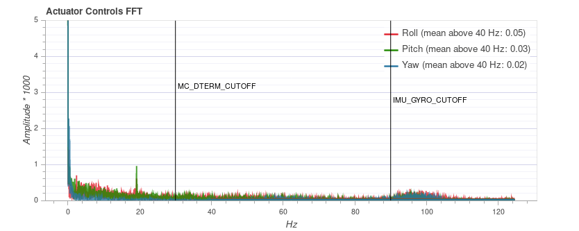
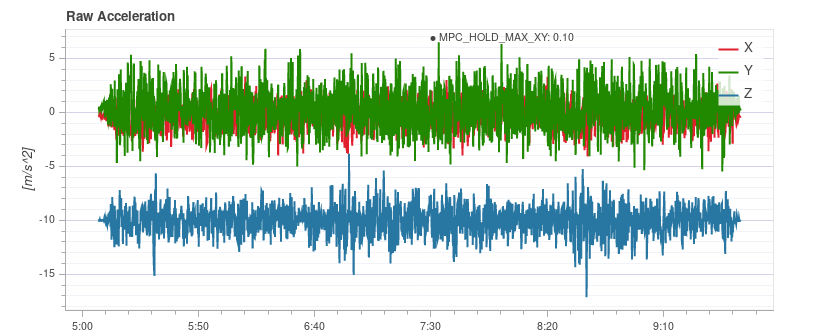
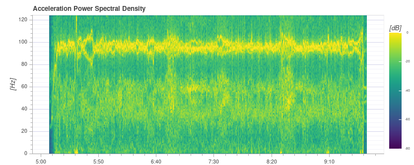

---

This is a really good example that shows what is achievable (on a [QAV-R 5" Racer](https://docs.px4.io/en/frames_multicopter/qav_r_5_kiss_esc_racer.html) frame).
Note that this allows to considerably increase the cutoff frequency of the software filters:
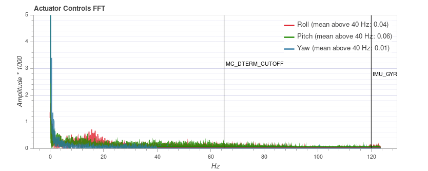
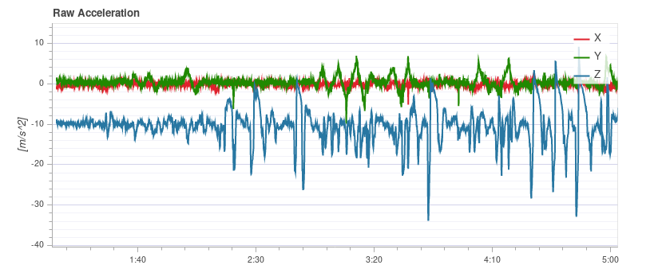
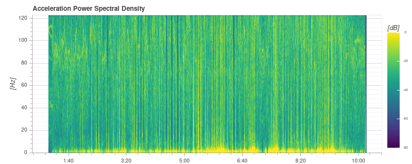
<!-- https://logs.px4.io/plot_app?log=cd88b091-ec89-457c-85f6-e63e4fa0f51d -->

---

The following is an example from an S500 frame: the Actuator Controls FFT plot looks good, whereas the vibration levels are a bit high for x and y in the Raw Acceleration plot (which is typical for an S500 airframe).
This is at the limit where it starts to negatively affect flight performance.

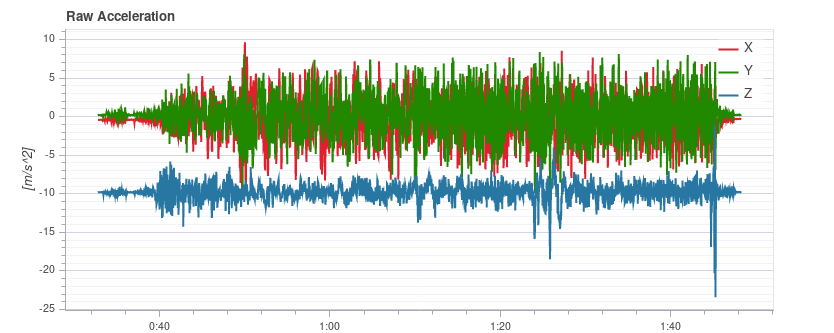
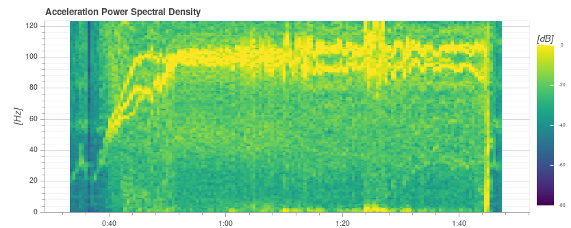

## Actuator Outputs

This shows the signals that are sent to the individual actuators (motors/servos).
Generally it is in the range between the minimum and maximum configured PWM values (e.g. from 1000 to 2000).
The plot can help to identify different problems:
- If one or more of the signals is at the maximum over a longer time, it means the controller runs into **saturation**.
  It is not necessarily a problem, for example when flying at full throttle this is expected.
  But if it happens for example during a mission, it's an indication that the vehicle is overweight for the amount of thrust that it can provide.
- For a multicopter the plot can be a good indication if the vehicle is **imbalanced**.
  It shows in the plot that one or more neighboring motors (two in case of a quadrotor) need to run at higher thrust on average.
  Note that this can also be the case if some motors provide more thrust than others or the ESCs are not calibrated.
  An imbalanced vehicle is generally not a big problem as the autopilot will automatically account for it.
  However it reduces the maximum achievable thrust and puts more strain on some motors, so it is better to balance the vehicle.
- An imbalance can also come from the yaw axis.
  The plot will look similar as in the previous case, but opposite motors will run higher or lower respectively.
  The cause is likely that one or more motors are tilted.

  This is an example from a hexarotor: motors 1, 3 and 6 run at higher thrust:
  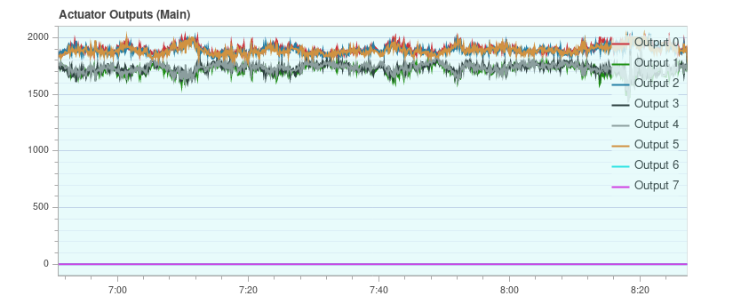
  <!-- https://logs.px4.io/plot_app?log=9eca6934-b657-4976-a32f-b2e56535f05f -->
- If the signals look very **noisy** (with high amplitudes), it can have two causes: sensor noise or vibrations passing through the controller (this shows up in other plots as well, see previous section) or too high PID gains.
  This is an extreme example:
  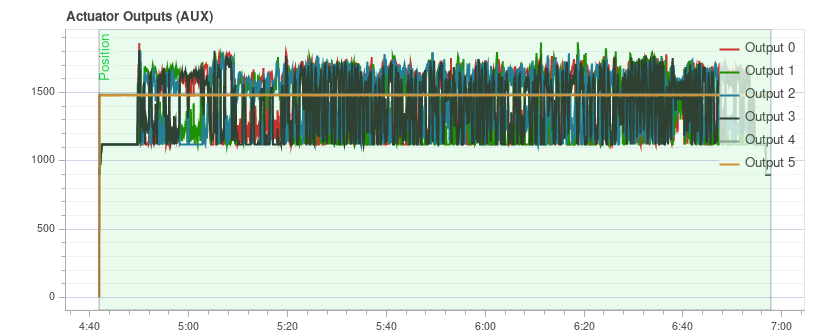
- Example for a quadrotor where everything is ok:
  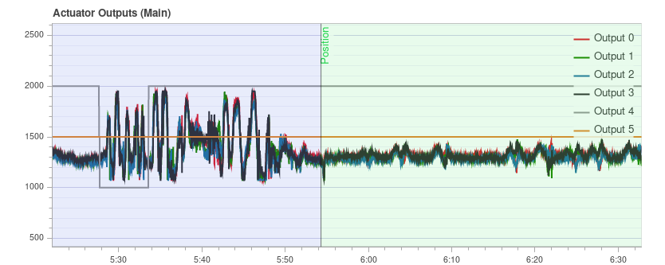

  
## GPS Uncertainty

The GPS Uncertainty plot shows information from the GPS device:
- the number of used satellites: it should be around 12 or higher
- horizontal position accuracy: it should be below 1 meter
- vertical position accuracy: it should be below 2 meters
- the GPS fix: this is 3 for a 3D GPS fix, 5 for RTK float and 6 for RTK fixed type

## GPS Noise & Jamming

The GPS Noise & Jamming plot is useful to check for GPS signal interferences and jamming.
The GPS signal is very weak and thus it can easily be disturbed/jammed by components transmitting (via cable) or radiating in a frequency used by the GPS.

For example USB 3 is known to be an effective GPS jamming source.

The **jamming indicator** should be around or below 40. Values around 80 or higher are too high and the setup must be inspected.
Signal interferences are also noticeable as reduced accuracy and lower number of satellites up to the point where no GPS fix is possible anymore.

This is an example without any interferences:
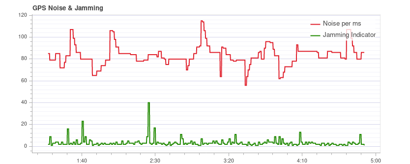

## Thrust and Magnetic Field

This plot shows the thrust and the norm of the magnetic sensor measurement vector.
The norm should be constant over the whole flight and uncorrelated from the thrust.
If it is correlated, it means that the current drawn by the motors (or other consumers) is influencing the magnetic field.
This must be avoided as it leads to incorrect yaw estimation. 
Solutions to this are:
- avoid using the internal magnetometer, use an external one,
- if an external one is already used, move it further away from strong currents, for example with a (longer) GPS mast.

In case it is uncorrelated but not constant, most likely it is not (or not correctly) calibrated.
However it could also be due to external disturbances, for example when flying close to metal constructs.

The following plot shows a strong correlation between the thrust and the norm of the magnetometer:
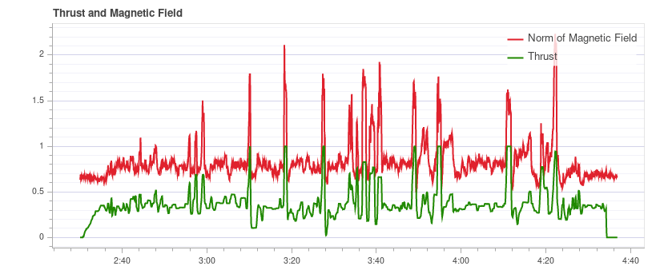

This example shows that the norm is non-constant, but it does not correlate with the thrust, so there is another problem:
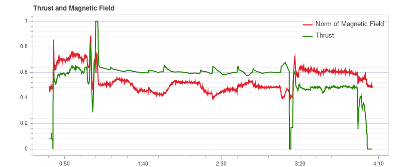

This is a good example where the norm is very close to constant:
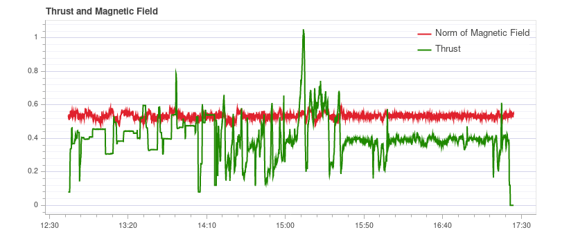

## Estimator Watchdog

The estimator watchdog plot shows the health report of the estimator.
It should be constant zero.
If one of the flags is non-zero, the estimator detected a problem that needs to be further investigated.
Most of the time it is an issue with a sensor, for example magnetometer interferences.
It usually helps to look at the plots of the corresponding sensor.
<!-- TODO: separate page for estimator issues? -->

This is what it should look like if there are no problems:
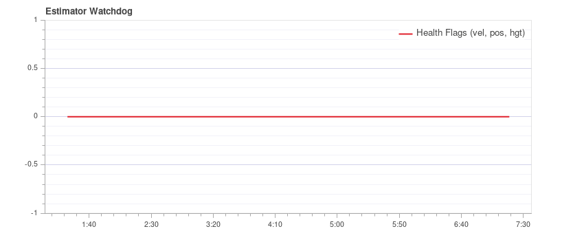

And here is an example with magnetometer problems:
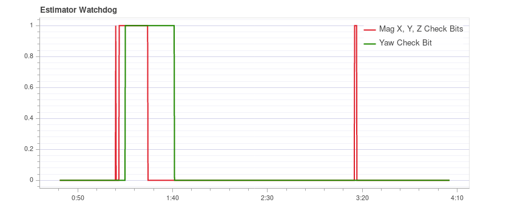

## Sampling Regularity of Sensor Data

The sampling regularity plot provides insights into problems with the logging system and scheduling.

The amount of **logging dropouts** start to increase if the log buffer is too small, the logging rate is too high or a low-quality SD card is used.
Occasional dropouts can be expected though.

The **delta t** shows the time difference between two logged IMU samples.
It should be close to 4 ms because the data publishing rate is 250Hz.
If there are spikes that are a multiple of that (and the estimator time slip does not increase), it means the logger skipped some samples.
Occasionally this can happen because the logger runs at lower priority.
If there are spikes that are not a multiple, it indicates an irregular sensor driver scheduling, which needs to be investigated.

The **estimator timeslip** shows the difference between the current time and the time of the integrated sensor intervals up to that time.
If it changes it means either the estimator missed sensor data or the driver publishes incorrect integration intervals.
It should stay at zero, but it can increase slightly for in-flight parameter changes, which is generally not an issue.

This is a good example:
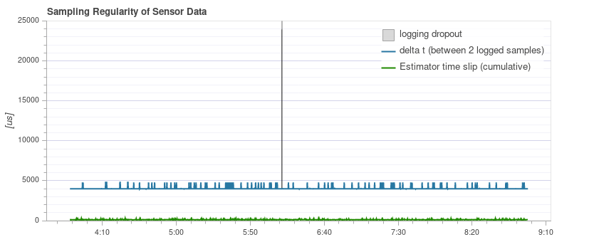

The following example contains too many dropouts, the quality of the used SD card was too low in that case
(see [here](../log/logging.md#sd-cards) for good SD cards):
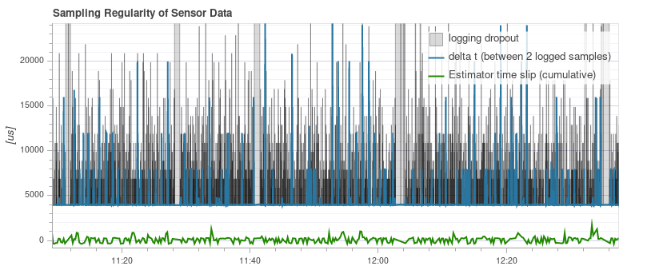

## Logged Messages

This is a table with system error and warning messages. 
For example they show when a task becomes low on stack size.
The messages need to be examined individually, and not all of them indicate a problem.
For example the following shows a kill-switch test:

