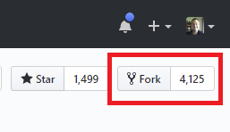
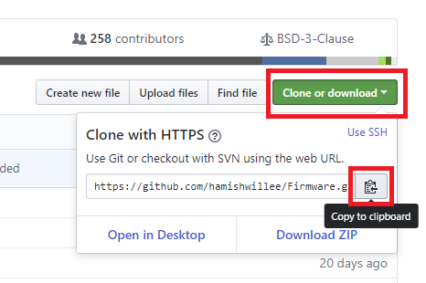
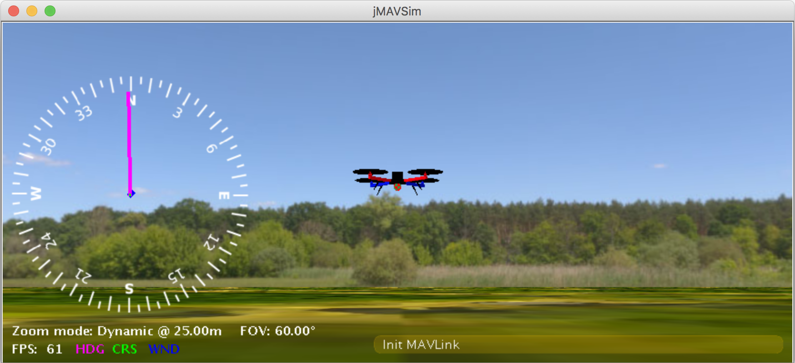

# Building PX4 Software

PX4 can be built on the console or in an IDE, for both simulated and hardware targets. 

## Downloading PX4 Source Code {#get_px4_code}

The PX4 source code is stored on Github in the [PX4/Firmware](https://github.com/PX4/Firmware) repository. We recommend that you [fork](https://help.github.com/articles/fork-a-repo/) this repository (creating a copy associated with your own Github account), and then [clone](https://help.github.com/articles/cloning-a-repository/) the source to your local computer.

> **Tip** Forking the repository allows you to better manage your custom code. Later on you will be able to use *git* to share changes with the main project.

The steps to fork and clone the project source code are:

1. [Sign up](https://github.com/) to Github.
1. Go to the [Firmware](https://github.com/PX4/Firmware) repository and click the **Fork** button near the upper right corner.
   This will create and open the forked repository.

   
1. Copy the repository URL for your *Firmware* repository fork. The easiest way to do this is to click the **Clone or download** button and then copy the URL:

   
1. Open a command prompt/terminal on your computer
   * On OS X, hit ⌘-space and search for 'terminal'. 
   * On Ubuntu, click the launch bar and search for 'terminal'. 
   * On Windows, find the PX4 folder in the start menu and click on 'PX4 Console'. 
1. Clone the repository fork using the copied URL. This will look something like:
   ```
   git clone https://github.com/<youraccountname>/Firmware.git
   ```
   
   > **Tip** If you're just experimenting (and don't want to make any sort of permanent changes) you can simply clone the main Firmware repository as shown:
   >  ```sh
   >  git clone https://github.com/PX4/Firmware.git
   >  ```
   
   Windows users [refer to the Github help](https://help.github.com/desktop/guides/getting-started-with-github-desktop/installing-github-desktop/). 
   You can use a *git* command line client as above or instead perform the same actions with the *Github for Windows* app.

<span id="specific_version_source"></span>
This will copy *most* of the *very latest* version of PX4 source code onto your computer 
(the rest of the code is automatically fetched from other [git submodules](https://git-scm.com/book/en/v2/Git-Tools-Submodules) when you build PX4).

> **Tip** To get the source for a *specific older release*, you could then:
> ```sh
>  # Navigate into Firmware directory
>  cd Firmware
>
>  # list the releases (tags)
>  git tag -l
>  
>  # Checkout code for particular tag (e.g. for tag 1.7.4beta)
>  git checkout v1.7.4beta
>  ```


## First Build (Using the jMAVSim Simulator) {#jmavsim_build}

For the first build we'll build for a simulated target using a console environment. This allows us to validate the system setup before moving on to real hardware and an IDE.

Navigate into the **Firmware** directory and start [jMAVSim](../simulation/jmavsim.md) using the following command:
```sh
make posix jmavsim
```

This will bring up the PX4 console below:


The drone can be flown by typing:
```sh
pxh> commander takeoff
```



The drone can be landed by typing `commander land` and the whole simulation can be stopped by doing **CTRL+C** (or by entering `shutdown`). 

> **Tip** The simulation setup is documented in full detail here: [jMAVSim Simulation](../simulation/jmavsim.md).

Flying the simulation with the ground control station is closer to the real operation of the vehicle. Click on a location in the map while the vehicle is flying (takeoff flight mode) and enable the slider. This will reposition the vehicle.


## NuttX / Pixhawk Based Boards

### Building {#building_nuttx}

To build for NuttX- or Pixhawk- based boards, navigate into the **Firmware** directory and then call `make` with the build target for your board. 

> **Note** In the example below the first part of the build target `px4fmu-v4` is the autopilot hardware version and `default` is the configuration name (in this case the "default" configuration). All PX4 build targets follow this logic).

For example, to build for *Pixracer* you would use the following command:
```sh
cd Firmware
make px4fmu-v4_default
```
A successful run will end with similar output to:
```sh
-- Build files have been written to: /home/youruser/src/Firmware/build/nuttx_px4fmu-v4_default
[954/954] Creating /home/youruser/src/Firmware/build/nuttx_px4fmu-v4_default/px4fmu-v4_default.px4
```

The following list shows the build commands for common boards:
* Pixhawk 4: `make px4fmu-v5_default`
* [Pixracer](https://docs.px4.io/en/flight_controller/pixracer.html): `make px4fmu-v4_default`
* [Pixhawk 3 Pro](https://docs.px4.io/en/flight_controller/pixhawk3_pro.html): `make px4fmu-v4pro_default`
* [Pixhawk Mini](https://docs.px4.io/en/flight_controller/pixhawk_mini.html): `make px4fmu-v3_default`
* [Pixhawk 2](https://docs.px4.io/en/flight_controller/pixhawk-2.html): `make px4fmu-v3_default`
* [mRo Pixhawk](https://docs.px4.io/en/flight_controller/mro_pixhawk.html): `make px4fmu-v3_default` (supports 2MB Flash)
* [HKPilot32](https://docs.px4.io/en/flight_controller/HKPilot32.html): `make px4fmu-v2_default`
* [Pixfalcon](https://docs.px4.io/en/flight_controller/pixfalcon.html): `make px4fmu-v2_default`
* [Dropix](https://docs.px4.io/en/flight_controller/dropix.html): `make px4fmu-v2_default`
* [MindPX](https://docs.px4.io/en/flight_controller/mindpx.html)/[MindRacer](https://docs.px4.io/en/flight_controller/mindracer.html): `make mindpx-v2_default`
* [mRo X-2.1](https://docs.px4.io/en/flight_controller/mro_x2.1.html): `make auav-x21_default` 
* [Crazyflie 2.0](https://docs.px4.io/en/flight_controller/crazyflie2.html): `make crazyflie_default`
* [Intel® Aero Ready to Fly Drone](https://docs.px4.io/en/flight_controller/intel_aero.html): `make aerofc-v1_default`
* [Pixhawk 1](https://docs.px4.io/en/flight_controller/pixhawk.html): `make px4fmu-v2_default`
  > **Warning** You **must** use a [supported version of GCC](../setup/dev_env_linux_ubuntu.md#nuttx-based-hardware) to build this board (e.g. the same as used by [CI/docker](../test_and_ci/docker.md)) or remove modules from the build. Building with an unsupported GCC may fail, as PX4 is close to the board's 1MB flash limit.
* Pixhawk 1 with 2 MB flash: `make px4fmu-v3_default`


### Uploading Firmware (Flashing the board)

Append `upload` to the make commands to upload the compiled binary to the autopilot hardware via USB. For example

```sh
make px4fmu-v4_default upload
```

A successful run will end with this output:

```sh
Erase  : [====================] 100.0%
Program: [====================] 100.0%
Verify : [====================] 100.0%
Rebooting.

[100%] Built target upload
```

## Other Boards

The following boards have more complicated build and/or deployment instructions.

### Raspberry Pi 2/3 Boards

The command below builds the target for [Raspberry Pi 2/3 Navio2](https://docs.px4.io/en/flight_controller/raspberry_pi_navio2.html).

#### Cross-compiler Build

```sh
cd Firmware
make posix_rpi_cross # for cross-compiler build
```

The "px4" executable file is in the directory **build/posix_rpi_cross/**.
Make sure you can connect to your RPi over ssh, see [instructions how to access your RPi](https://docs.px4.io/en/flight_controller/raspberry_pi_navio2.html#developer-quick-start).

Then set the IP (or hostname) of your RPi using:

```sh
export AUTOPILOT_HOST=192.168.X.X
```

And upload it with:

```sh
cd Firmware
make posix_rpi_cross upload # for cross-compiler build
```

Then, connect over ssh and run it with (as root):

```sh
sudo ./bin/px4 -s px4.config
```

#### Native Build

If you're building *directly* on the Pi, you will want the native build target (posix_rpi_native).

```sh
cd Firmware
make posix_rpi_native # for native build
```

The "px4" executable file is in the directory **build/posix_rpi_native/**.
Run it directly with:

```sh
sudo ./build/posix_rpi_native/px4 ./posix-configs/rpi/px4.config
```

A successful build followed by executing px4 will give you something like this:

```sh

______  __   __    ___
| ___ \ \ \ / /   /   |
| |_/ /  \ V /   / /| |
|  __/   /   \  / /_| |
| |     / /^\ \ \___  |
\_|     \/   \/     |_/

px4 starting.


pxh>
```

#### Autostart

To autostart px4, add the following to the file **/etc/rc.local** (adjust it
accordingly if you use native build), right before the `exit 0` line:
```sh
cd /home/pi && ./bin/px4 -d -s px4.config > px4.log
```


### Parrot Bebop

Support for the [Parrot Bebop](https://docs.px4.io/en/flight_controller/bebop.html) is at an early stage and should be used very carefully.

#### Build
```sh
cd Firmware
make posix_bebop_default
```

Turn on your Bebop and connect your host machine with the Bebop's wifi. Then, press the power button
four times to enable ADB and to start the telnet daemon.

```sh
make posix_bebop_default upload
```

This will upload the PX4 mainapp into /data/ftp/internal_000/ and create the file /home/root/parameters if not already
present. This also uploads the mixer file and the px4.config file into the /home/root/ directory.

#### Run
Connect to the Bebop's wifi and press the power button four times. Next,
connect with the Bebop via telnet or adb shell and run the commands bellow.

```sh
telnet 192.168.42.1
```

Kill the Bebop's proprietary driver with
```sh
kk
```
and start the PX4 mainapp with:
```sh
/data/ftp/internal_000/px4 -s /home/root/px4.config
```

In order to fly the Bebop, connect a joystick device with your host machine and start QGroundControl. Both,
the Bebop and the joystick should be recognized. Follow the instructions to calibrate the sensors
and setup your joystick device.

#### Autostart

To auto-start PX4 on the Bebop at boot, modify the init script `/etc/init.d/rcS_mode_default`. Comment the following line:
```
DragonStarter.sh -out2null &
```
Replace it with:
```
echo 1 > /sys/class/gpio/gpio85/value # enables the fan
/data/ftp/internal_000/px4 -d -s /home/root/px4.config > /home/root/px4.log &
```

Enable adb server by pressing the power button 4 times and connect to adb server as described before:
```sh
adb connect 192.168.42.1:9050
```
Re-mount the system partition as writeable:
```sh
adb shell mount -o remount,rw /
```
In order to avoid editing the file manually, you can use this one : https://gist.github.com/bartslinger/8908ff07381f6ea3b06c1049c62df44e

Save the original one and push this one to the Bebop
```sh
adb shell cp /etc/init.d/rcS_mode_default /etc/init.d/rcS_mode_default_backup
adb push rcS_mode_default /etc/init.d/
```
Sync and reboot:
```sh
adb shell sync
adb shell reboot
```

### OcPoC-Zynq Mini

Build instructions for the [OcPoC-Zynq Mini](https://docs.px4.io/en/flight_controller/ocpoc_zynq.html) are covered in:
* [Aerotenna OcPoC-Zynq Mini Flight Controller > Building PX4 for OcPoC-Zynq](https://docs.px4.io/en/flight_controller/ocpoc_zynq.html#building-px4-for-ocpoc-zynq) (PX4 User Guide)
* [OcPoC PX4 Setup Page](https://aerotenna.readme.io/docs/px4-setup)


### QuRT / Snapdragon Based Boards

This section shows how to build for the [Qualcomm Snapdragon Flight](https://docs.px4.io/en/flight_controller/snapdragon_flight.html).

#### Build

> **Note** If you use the [Qualcomm ESC board](http://shop.intrinsyc.com/products/qualcomm-electronic-speed-control-board) (UART-based), then please follow their instructions [here](https://github.com/ATLFlight/ATLFlightDocs/blob/master/PX4.md). If you use normal PWM-based ESCs boards, then you may continue to follow the instructions on this page.

The commands below build the targets for the Linux and the DSP side. Both executables communicate via [muORB](../middleware/uorb.md).

```sh
cd Firmware
make eagle_default
```

To load the SW on the device, connect via USB cable and make sure the device is booted. Run this in a new terminal window:

```sh
adb shell
```

Go back to previous terminal and upload:

```sh
make eagle_default upload
```

Note that this will also copy (and overwrite) the two config files [mainapp.config](https://github.com/PX4/Firmware/blob/master/posix-configs/eagle/flight/mainapp.config) and [px4.config](https://github.com/PX4/Firmware/blob/master/posix-configs/eagle/flight/px4.config) to the device. Those files are stored under /usr/share/data/adsp/px4.config and /home/linaro/mainapp.config respectively if you want to edit the startup scripts directly on your vehicle.

The mixer currently needs to be copied manually:

```sh
adb push ROMFS/px4fmu_common/mixers/quad_x.main.mix  /usr/share/data/adsp
```

#### Run

Run the DSP debug monitor:

```sh
${HEXAGON_SDK_ROOT}/tools/debug/mini-dm/Linux_Debug/mini-dm
```

Note: alternatively, especially on Mac, you can also use [nano-dm](https://github.com/kevinmehall/nano-dm).

Go back to ADB shell and run px4:

```sh
cd /home/linaro
./px4 mainapp.config
```

Note that the px4 will stop as soon as you disconnect the USB cable (or if you ssh session is disconnected). To fly, you should make the px4 auto-start after boot.

#### Autostart

To run the px4 as soon as the Snapdragon has booted, you can add the startup to `rc.local`:

Either edit the file `/etc/rc.local` directly on the Snapdragon:

```sh
adb shell
vim /etc/rc.local
```

Or copy the file to your computer, edit it locally, and copy it back:

```sh
adb pull /etc/rc.local
gedit rc.local
adb push rc.local /etc/rc.local
```

For the auto-start, add the following line before `exit 0`:

```sh
(cd /home/linaro && ./px4 mainapp.config > mainapp.log)

exit 0
```

Make sure that the `rc.local` is executable:

```sh
adb shell
chmod +x /etc/rc.local
```

Then reboot the Snapdragon:

```sh
adb reboot
```

## Compiling in a Graphical IDE

The PX4 system supports Qt Creator, Eclipse and Sublime Text. Qt Creator is the most user-friendly variant and hence the only officially supported IDE. Unless an expert in Eclipse or Sublime, their use is discouraged. Hardcore users can find an [Eclipse project](https://github.com/PX4/Firmware/blob/master/eclipse.project) and a [Sublime project](https://github.com/PX4/Firmware/blob/master/Firmware.sublime-project) in the source tree.

https://www.youtube.com/watch?v=Bkk8zttWxEI&rel=0&vq=hd720

## Qt Creator Functionality

Qt creator offers clickable symbols, auto-completion of the complete codebase and building and flashing firmware.


### Qt Creator on Linux

Before starting Qt Creator, the [project file](https://cmake.org/Wiki/CMake_Generator_Specific_Information#Code::Blocks_Generator) needs to be created:

```sh
cd ~/src/Firmware
mkdir ../Firmware-build
cd ../Firmware-build
cmake ../Firmware -G "CodeBlocks - Unix Makefiles"
```

Then load the CMakeLists.txt in the root firmware folder via File -> Open File or Project -> Select the CMakeLists.txt file.

After loading, the **play** button can be configured to run the project by selecting 'custom executable' in the run target configuration and entering 'make' as executable and 'upload' as argument.

### Qt Creator on Windows

> **Note** Windows has not been tested for PX4 development with Qt Creator.


### Qt Creator on Mac OS

Before starting Qt Creator, the [project file](https://cmake.org/Wiki/CMake_Generator_Specific_Information#Code::Blocks_Generator) needs to be created:

```sh
cd ~/src/Firmware
mkdir -p build/creator
cd build/creator
cmake ../.. -G "CodeBlocks - Unix Makefiles"
```

That's it! Start *Qt Creator*, then complete the steps in the video below to set up the project to build.

https://www.youtube.com/watch?v=0pa0gS30zNw&rel=0&vq=hd720
