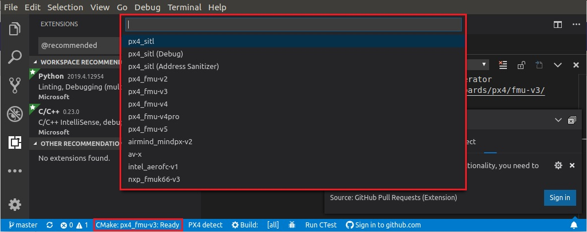

# Visual Studio Code IDE

Visual Studio Code (VSCode) is a powerful cross-platform source code editor/IDE that can be used for PX4 development on Linux and macOS (Windows support coming soon).

There are a number of reasons to use VSCode for PX4 development:
- Getting setup *really* only takes a few minutes!
- A rich extension ecosystem that enables a huge range of tools needed for PX4 development: C/C++ (with solid cmake integration), Python, Jinja2, ROS messages, and even UAVCAN dsdl.
- Excellent Github integration.

This topic explains how to setup the IDE and start developing.

> **Note** There are other powerful IDEs, but they typically take significant effort to integrate with PX4.
  With VScode configuration is stored in the PX4/Firmware tree ([Firmware/.vscode](https://github.com/PX4/Firmware/tree/master/.vscode)) so the setup process is as simple as adding the project folder.

## Preconditions

You must already have installed the command line [PX4 developer environment](../setup/dev_env.md) for your platform and downloaded the *Firmware* source code repo.

## Installation & Setup

1. [Download and install VSCode](https://code.visualstudio.com/) (you will be offered the correct version for your OS).
1. Add the PX4 source code into VSCode: 
   - Select *Open folder ...* option on the welcome page (or using the menu: **File > Open Folder**):
     
   - A file selection dialog will appear.
     Select the PX4 **Firmware** directory.

   The project files and configuration will then load into VSCode.
1. Press **Install All** on the *This workspace has extension recommendations* prompt (this will appear after a moment on the bottom right of the IDE).
   

   VSCode will open the Extensions panel on the left hand side so you can watch the progress of installation.

   
1. A number of notifications/prompts may appear in the bottom right corner (if these disappear, click the little "alarm" icon on the right of the blue bar at the bottom).
   - If prompted to install a new version of *cmake*:
     On Ubuntu 18.04 you can say "no".
   - If prompted to sign into *github.com* and add your credentials:
     This is optional. It provides a deep integration between Github and the IDE.

## Code Completion

In order for the code completion to work (and other intellisense magic) you need an active config and to have built the code (we show you how in the next section).

Once that is done you don't need to do anything else; the toolchain will automatically offer you symbols as you type.

<!--
1. Select a kit.
   - You can launch the kit selection dialog by choosing *No Kit Selected* on the bottom bar (if a kit is already selected that will be displayed instead)
     
   - Select *PX4 Detect* in the dialog:
     
-->
     
## Build & Debugging

To build or debug:
1. Load a cmake build config (i.e. a build target):
   - Select the existing cmake target from the bottom config bar.
     
   - In the dialog, select your build target (this will replace any selected target).
1. You can then kick off a debugging session or run a build using the config bar on the bottom.
   

Once debugging you can set breakpoints, step over code, and otherwise develop as normal. 

<!-- px4 at the bottom - select target to launch - test mixer multi_rotor or PX4 -->
