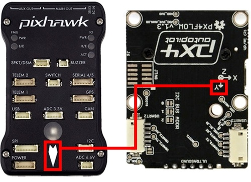

# Optical Flow
Optical Flow uses a downward facing camera and a downward facing distance sensor for position estimation. Optical Flow based navigation is supported by all three estimators: EKF2, LPE and INAV (see below).

## Setup
As mentioned above, an Optical Flow setup requires a downward facing camera which publishes to the [`OPTICAL_FLOW_RAD` topic](http://mavlink.org/messages/common#OPTICAL_FLOW_RAD) and a distance sensor (preferably a LiDAR) publishing messages to the [`DISANCE_SENSOR` topic](http://mavlink.org/messages/common#DISTANCE_SENSOR).

The output of the flow has to be as follows

| Moving direction of the MAV | Integrated flow |
| -- | -- |
| Forwards | + Y |
| Backwards | - Y |
| Right | - X |
| Left | + X |

And for pure rotations, the integraded_xgyro and integraded_x (respectively integraded_ygyro and integraded_y) have to be the same.

An exemplary setup is the PX4Flow and LIDAR-Lite (see picture).

### Cameras

#### PX4Flow
The easiest way to calculate the optical flow is to use the PX4Flow board. In order to use the PX4Flow board, just connect it with I2C. The recommended way of mounting it is with the Sonar side facing forwards (see image). In this configuration the parameter `SENS_FLOW_ROT` should be 270 degrees (which is the default). Make sure the the PX4Flow board is well dampened.

In order to ensure good optical flow quality, it is important to focus the camera on the PX4Flow to the desired height of flight. To focus the camera, put an object with text on (e. g. a book) and plug in the PX4Flow into USB and run QGroundControl. Under the settings menu, select the PX4Flow and you should see a camera image. Focus the lens by unscrewing the set screw and loosening and tightening the lens to find where it is in focus.

**Note: If you fly above 3m, the camera will be focused at infinity and won't need to be changed for higher flight.**

*Figure: Use a text book to focus the flow camera at the height you want to fly, typically 1-3 meters. Above 3 meters the camera should be focused at infinity and work for all higher altitudes.*

*Figure: The px4flow interface in QGroundControl that can be used for focusing the camera*

#### Other cameras
It is also possible to use a board/quad that has an integrated camera (Bebop2, Snapdragon Flight). For this the [Optical Flow repo](https://github.com/PX4/OpticalFlow) can be used (see also [snap_cam](https://github.com/PX4/snap_cam)).

### Range Finder
We recommend using a LIDAR over a Sonar, because of robustness and accuracy. One possibility is the [LIDAR-Lite](https://pixhawk.org/peripherals/rangefinder).

## Estimators

### Extended Kalman Filter (EKF2)
In order to use the EKF2 estimator, make sure the parameter `SYS_MC_EST_GROUP` is set to `2` and reboot. For Optical Flow fusion, the parameter `EKF2_AID_MASK` has to be set accordingly.

### Local Position Estimator (LPE)
TODO

<!-- ### INAV (not under active development anymore)
The INAV has a fixed gain matrix for correction and can be viewed as a steady state Kalman filter. It has the lowest computational cost of all position estimators.

#### Flight Video Indoor
https://www.youtube.com/watch?v=MtmWYCEEmS8

#### Flight Video Outdoor
https://www.youtube.com/watch?v=4MEEeTQiWrQ

#### Parameters
* `INAV_LIDAR_EST` Set to 1 to enable altitude estimation based on distance measurements
* `INAV_FLOW_DIST_X` and `INAV_FLOW_DIST_Y`
	These two values (in meters) are used for yaw compensation.
	The offset has to be measured according to Figure 1 above.
	In the above example the offset of the PX4Flow (red dot) would have a negative X offset and a negative Y offset.
* `INAV_LIDAR_OFF`
	Set a calibration offset for the lidar-lite in meters. The value will be added to the measured distance.

#### Advanced Parameters

For advanced usage/development the following parameters can be changed as well. Do NOT change them if you do not know what you are doing!

* `INAV_FLOW_W`
	Sets the weight for the flow estimation/update
* `INAV_LIDAR_ERR`
	Sets the threshold for altitude estimation/update in meters. If the correction term is bigger than this value, it will not be used for the update. -->
