# PX4용 MCU Eclipse/J-Link 디버깅

이 주제에서는 [MCU Eclipse](https://gnu-mcu-eclipse.github.io/)와 NuttX에서 동작하는 PX4 디버깅장비 *Segger Jlink adapter*를 설치하고 활용하는 방법을 설명합니다.

## 필요한 하드웨어

- [J-Link EDU Mini](https://www.segger.com/products/debug-probes/j-link/models/j-link-edu-mini/)
- Segger JLink를 비행체 제어 장치로 연결하는 어댑터 [SWD (JTAG) 하드웨어 디버깅 인터페이스](../debug/swd_debug.md)(디버깅 포트).
- 마이크로 USB 케이블
- 대상 하드웨어에 연결할 적당한 케이블.

## 설치

### PX4

일반 지침을 따라 PX4를 설치하십시오:
- 해당 플랫폼에 [PX4 개발자 환경/툴체인을 설치](../setup/dev_env.md) 하십시오(예: 리눅스의 경우 [우분투 LTS / 데비안 리눅스 개발 환경](../setup/dev_env_linux_ubuntu.md) 참고).
- [PX4를 다운로드](../setup/building_px4.md) 하고, 명령행에서 별도로 빌드하십시오.

### Eclipse

*Eclipse*를 설치하려면:
1. [Eclipse CDT for C/C++ Developers](https://github.com/gnu-mcu-eclipse/org.eclipse.epp.packages/releases/) (MCU Github)를 다운로드하십시오.
1. Eclipse 폴더 압축을 해제하고 어딘가에든 복사하십시오(별도의 설치 스크립트 실행은 필요하지 않습니다).
1. *Eclipse*를 실행하고 초기 작업 영역 위치를 선택하십시오.

### Segger Jlink 도구

*Segger Jlink* 도구를 설치하려면:
1. [J-Link Software and Documentation Pack](https://www.segger.com/downloads/jlink/#J-LinkSoftwareAndDocumentationPack)을 운영체제에 해당(윈도우와 리눅스용이 있음)하는 버전으로 다운로드하고 설치하십시오.
   - 리눅스 도구는 **usr/bin**에 설치합니다.

자세한 정보는 https://gnu-mcu-eclipse.github.io/debug/jlink/install/ 을 살펴보십시오.

## 첫 사용

1. *Segger JLink*를 (어댑터로) 호스트 컴퓨터와 [비행체 제어 장치 디버거 포트](../debug/swd_debug.md)에 연결하십시오.
1. 비행체 제어 장치 전원을 켜십시오.
1. *Eclipse*를 실행하십시오.
1. **File > Import > C/C++ > Existing Code as Makefile Project**를 선택하여 프로젝트에 소스 코드를 추가하고 **Next**를 누르십시오.
1. **Firmware** 펌웨어 폴더를 가리키고 이름을 지정한 후 *Toolchain for Indexer Settings*의 *ARM 교차 GCC*를 선택하고 **Finish**를 누르십시오. 상당한 시간동안 가져옵니다. 끝날 때까지 기다리십시오.
1. MCU 설정을 맞추십시오: Project Explorer에서 상위레벨 프로젝트에 커서를 둔 후 오른쪽 단추를 눌러 *Properties*를 선택, MCU 하위 항목 중 *SEGGER J-Link Path*를 선택하십시오. 아래 화면 촬영 그림처럼 설정하십시오. 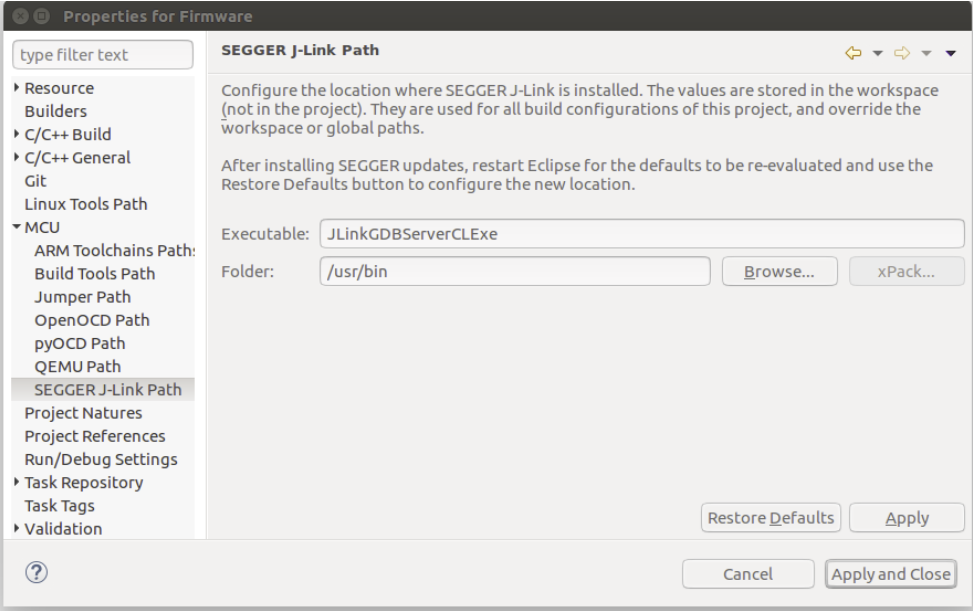
1. 패키지를 업데이트하십시오:
   - 우측 상단의 작은 *Open Perspective* 아이콘을 눌러 *Packs* 감시 창을 여십시오. 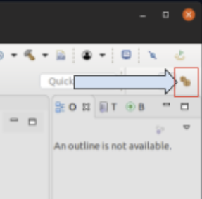
   - **update all** 단추를 누르십시오.

     > **Tip** 매우 오랜 시간이 걸립니다(10분). 화면에 뜨는 모든 빠진 패키지 오류는 무시하십시오.

     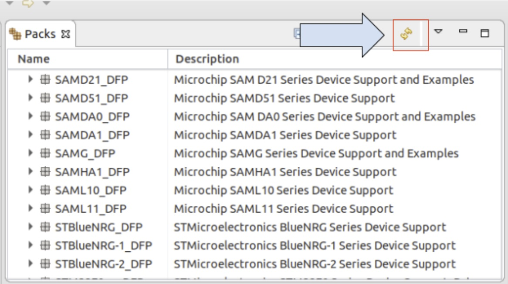
   - STM32Fxx 장치는 Keil 폴더에 있습니다. F4와 F7 장비의 드라이버에 마우스 커서를 둔 후 오른쪽 단추를 눌러 **설치**하십시오.
1. 대상에 대한 디버깅 설정을 진행하십시오:
   - 프로젝트 항목에 커서를 두어 오른쪽 단추를 누른 후 *설정*을 여십시오(메뉴:  **C/C++ Build > Settings**)
   - *Devices* 탭을 선택 후, *Devices* 섹션에 진입하십시오(*Boards*아님).
   - 디버깅할 FMU 칩을 찾으십시오.

   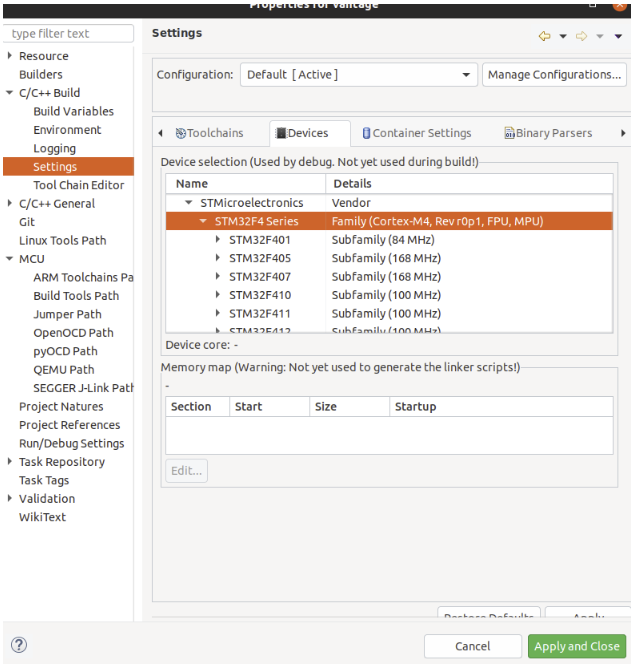
1. 버그 심볼 옆의 작은 드롭다운 유닛으로 디버깅 설정을 선택하십시오: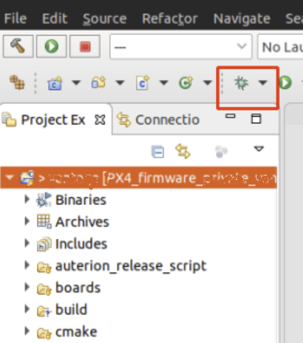
1. 그런 다음  *GDB SEGGER J-Link Debugging*을 선택하고 좌측 상단에서 **New config** 단추를 누르십시오. 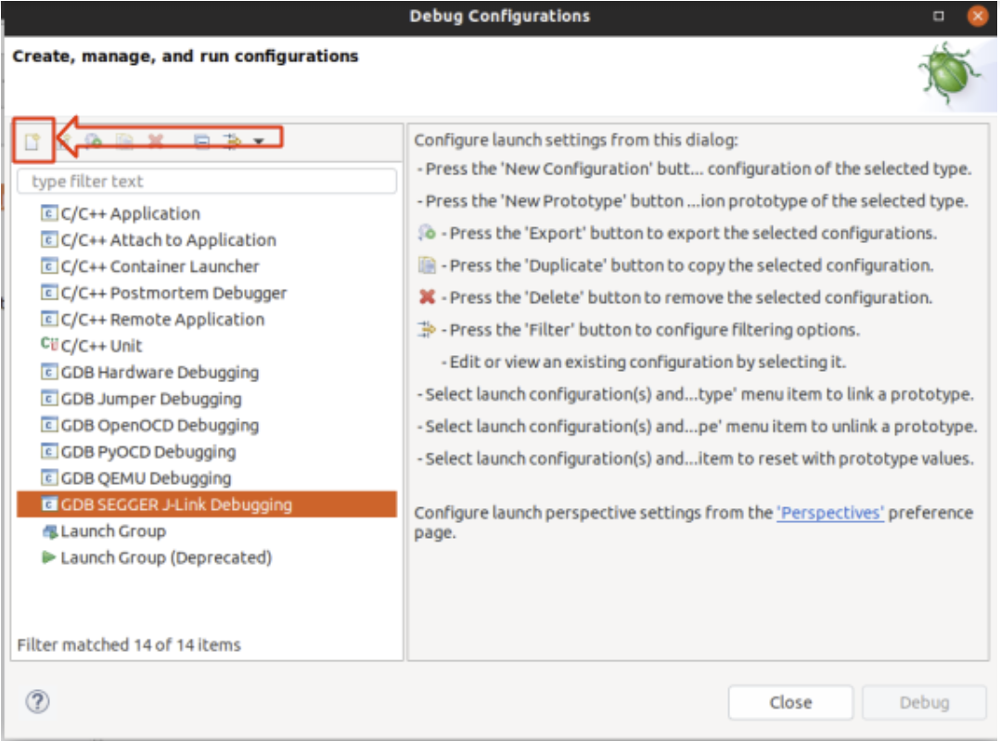
1. 빌드 값을 설정하십시오:
   - 이름을 지정하고 *C/C++ Application*을 해당 **.elf** 파일로 설정하십시오.
   - *Disable Auto build*를 선택하십시오 > **Note** 디버깅 세션을 시작하기 전 명령행에서 대상을 빌드해야 함을 기억하십시오.

   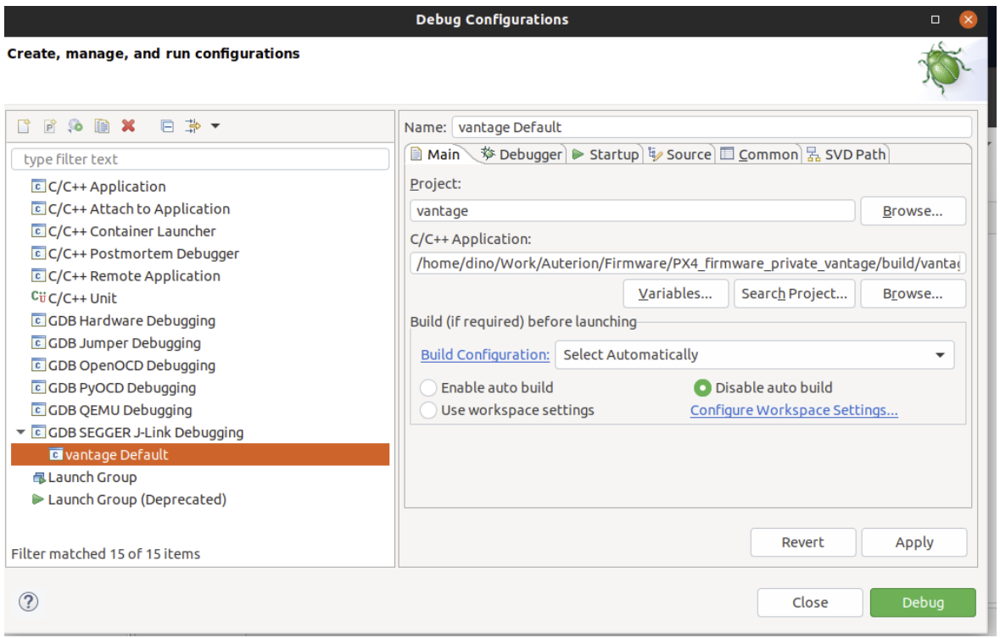
1. *Debugger*와 *Startup* 탭은 따로 수정하지 않아도 됩니다(아래 화면 그림과 같이 설정했는지만 확인하십시오)

   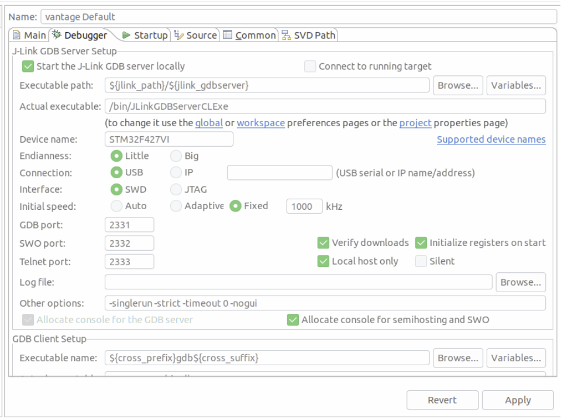 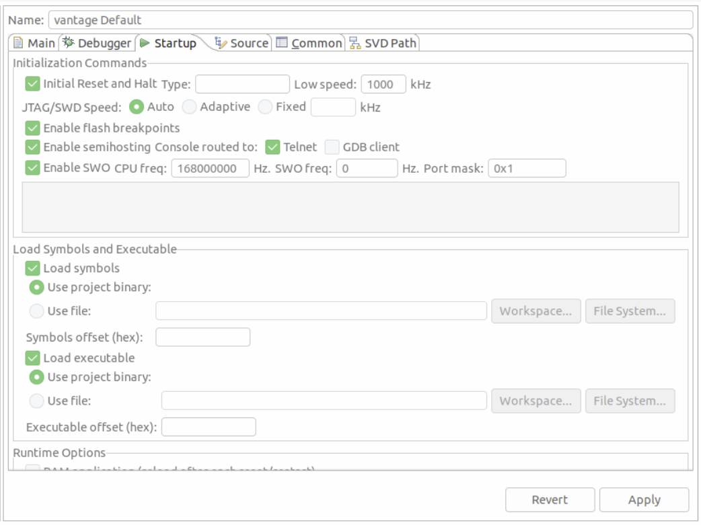

## 문제 해결

### 대상 CPU가 패키지 관리자에 없음

대상 CPU가 패키지 관리자에 없다면 레지스터 뷰가 동작하는지 확인하기 위해 다음 단계를 거쳐야 합니다.

> **Tip** 보통 일어나서는 안될 일입니다(만, STM F7 컨트롤러 연결에 대해 보고가 들어온 적이 있습니다).

*주변 장치 보기*에서 빠진 SVD 파일을 추가하려면:
1. MCU Eclipse 스토어에서 패키지를 찾으십시오(**Preferences > C/C++ > MCU Packages**): 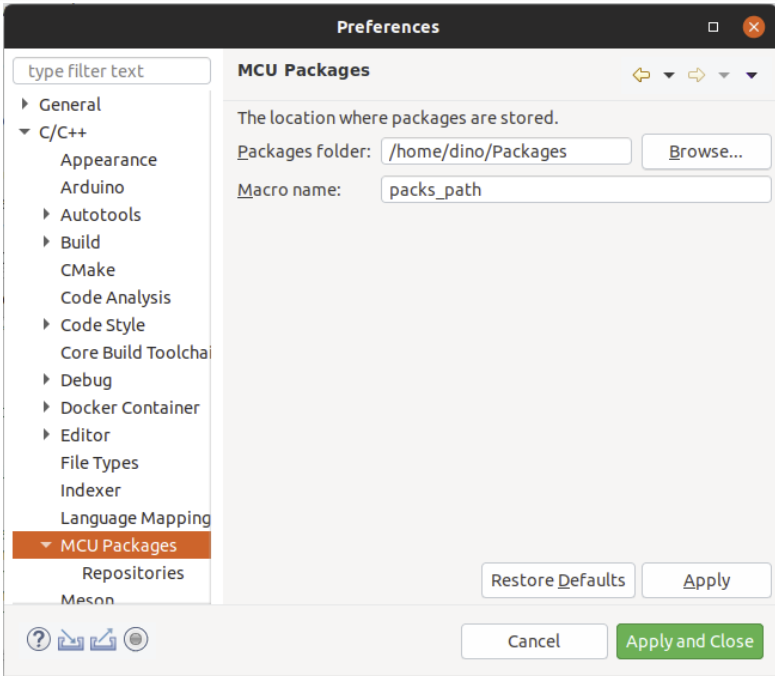
2. http://www.keil.com/dd2/Pack/ 에서 빠진 패키지를 다운로드하십시오
3. 압축 해제 도구로 다운로드한 팩을 여시고, **/CMSIS/SVD**의 **.SVD** 파일의 압축을 푸십시오.
4. **Debug Options > GDB SEGGER JLink Debugging > SVD Path**에서 원하는 **.SVD** 파일을 여십시오. 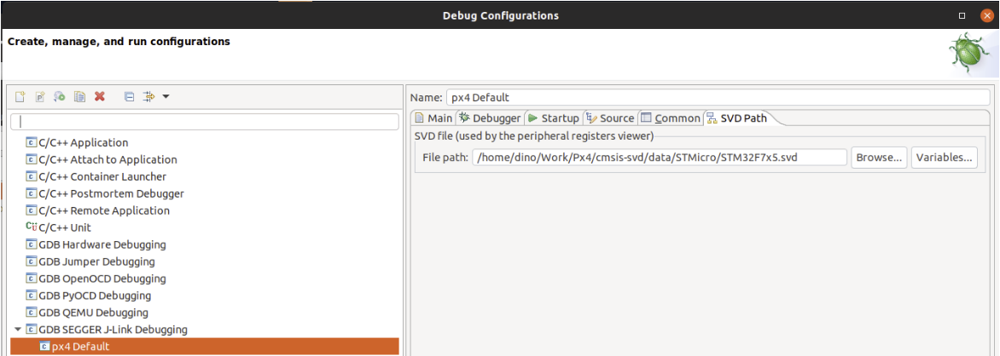
