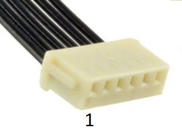
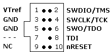

# SWD (JTAG) 하드웨어 디버깅 인터페이스

PX4는 보통 ARM 칩의 *직렬 회선 디버깅(SWD)*을 지원하는 오토파일럿 조종 장치 하드웨어에서 실행합니다. SWD는 ARM 프로세서에서 JTAG 디버깅을 수행할 때 적은 수의 핀을 물리 인터페이스로 연결하는 방식입니다. SWD 호환 디버깅 프로브로 PX4의 중단점을 설정하고 실제 장치에서 코드 실행을 단계별로 진행할 때 활용할 수 있습니다.

SWD 인터페이스는 새 부트로더 또는 펌웨어를 완전히 깡통인 (USB 부트로더를 설치한 적이 없는) 보드에 추가할 때 사용할 수 있습니다.

이 주제에서는 다양한 보드로의 SWD 인터페이스 연결 방법(실제 디버깅 수행 방법은 관련 [디버깅 주제](#debugging_topics)에서 다룸)을 설명합니다.

## SWD 인터페이스 정의  {#swd_interface}

SWD 인터페이스는 다음 핀으로 이루어져있습니다.

| 핀       | 신호 형식 | 설명                                                                                                                                             |
| ------- | ----- | ---------------------------------------------------------------------------------------------------------------------------------------------- |
| `Vref`  | 출력    | 대상 참조 전압.  일부 JTAG 어댑터에는 SWD 라인에 전압을 설정할 때 `Vref` 전압이 필요합니다. 예를 들면,  [SEGGER J-Link Debug Probes](#segger_jlink_edu_mini) 에서 `Vref`가 필요합니다. |
| `SWDIO` | 입출력   | 단일 전이중 데이터 핀.                                                                                                                                  |
| `SWCLK` | 출력    | 클록 신호.                                                                                                                                         |
| `GND`   | -     | 접지핀.                                                                                                                                           |

SWD의 "일부"는 아니지만, 오토파일럿에서는 *직렬 회선 출력 (SWO)* 추적 출력 핀이 있습니다. 만약 이 핀이 있다면 이 핀도 연결해야합니다.

| 핀     | 신호 형식 | 설명                                                       |
| ----- | ----- | -------------------------------------------------------- |
| `SWO` | 출력    | 직렬 회선 출력 방식의 추적 출력 핀. 실시간 추적 데이터를 인가하려면 *SWD*도 연결해야 합니다. |

## PX4 하드웨어로의 SWD 디버거 연결

디버깅 프루브의 `SWDIO`, `SWCLK`, `GND` 핀을 오토파일럿의 각 해당 핀으로 연결하십시오.

추가로:
- 디버깅 어댑터에서 `VRef` 핀 연결이 필요하다면 연결하십시오.
- `SWO` 핀이 있다면 연결하십시오.

일부 SWD [디버깅 프루브](#debug_probes)는 픽스호크 공용 [디버깅 포트](#debug_ports)에 연결할 어댑터와 케이블이 딸려옵니다. 다른 보드 또는 프루브에 연결할 개별 케이블을 직접 만들 수도 있습니다.

> **Note** 일부 제조사에서는 SWD 인터페이스와 [시스템 콘솔](../debug/system_console.md)을 쉽게 연결하는 케이블을 제공합니다. 예로서, [CUAV V5nano](http://docs.px4.io/master/en/flight_controller/cuav_v5_nano.html#debug_port)와 [CUAV V5+](http://docs.px4.io/master/en/flight_controller/cuav_v5_plus.html#debug-port)에 디버깅 케이블이 들어있습니다: 

> **Tip** Where possible, we highly recommend that you create or obtain an adapter board rather than custom cables for connecting to SWD/JTAG debuggers and computers. This reduces the risk or poor wiring contributing to debugging problems, and has the benefit that adapters usually provide a common interface for connecting to multiple popular flight controller boards.

## 오토파일럿 디버깅 포트 {#debug_ports}

비행 조종 장치는 보통 [SWD 인터페이스](#swd_interface)와 [시스템 콘솔](../debug/system_console.md)을 노출하는 디버깅 포트를 제공합니다.

[픽스호크 커넥터 표준](#pixhawk_standard_debug_ports)에서는 이 포트의 표준 제정을 시도합니다. 그러나 여러 보드가 다른 핀 출력 또는 커넥터를 쓰기 때문에, 오토파일럿의 포트 위치와 핀 출력 정보의 문서상 확인을 추천드립니다.

오토파일럿 일부 하위 집합의 디버깅 포트 위치와 핀  출력은 아래와 같습니다.

| 오토파일럿                                                                                                  | 커넥터                                                                                                                                                                                                                       |
| ------------------------------------------------------------------------------------------------------ | ------------------------------------------------------------------------------------------------------------------------------------------------------------------------------------------------------------------------- |
| [3DR Pixhawk](http://docs.px4.io/master/en/flight_controller/pixhawk.html#swd-port)                    | ARM 10-pin JTAG 커넥터 (*mRo Pixhawk*, *HobbyKing HKPilot32*등의 FMUv2 보드에서도 사용함).                                                                                                                                             |
| [CUAV V5nano](http://docs.px4.io/master/en/flight_controller/cuav_v5_nano.html#debug_port)             | 6-pin JST GH Digikey: [BM06B-GHS-TBT(LF)(SN)(N)](https://www.digikey.com/products/en?keywords=455-1582-1-ND) (수직 마운트), [SM06B-GHS-TBT(LF)(SN)(N)](https://www.digikey.com/products/en?keywords=455-1568-1-ND) (측면 마운트) |
| [CUAV V5+](http://docs.px4.io/master/en/flight_controller/cuav_v5_plus.html#debug-port)                | 6-pin JST GH Digikey: [BM06B-GHS-TBT(LF)(SN)(N)](https://www.digikey.com/products/en?keywords=455-1582-1-ND) (수직 마운트), [SM06B-GHS-TBT(LF)(SN)(N)](https://www.digikey.com/products/en?keywords=455-1568-1-ND) (측면 마운트) |
| [Drotek Pixhawk 3 Pro](http://docs.px4.io/master/en/flight_controller/pixhawk3_pro.html#debug-port)    | [Pixhawk 6-pin SH Debug](#pixhawk_debug_port_6_pin_sh)                                                                                                                                                                    |
| [Holybro Pixhawk 4](http://docs.px4.io/master/en/flight_controller/pixhawk4.html#debug_port)           | [Pixhawk 6-pin SH Debug](#pixhawk_debug_port_6_pin_sh)                                                                                                                                                                    |
| [Holybro Pixhawk 4 Mini](http://docs.px4.io/master/en/flight_controller/pixhawk4_mini.html#debug-port) | [Pixhawk 6-pin SH Debug](#pixhawk_debug_port_6_pin_sh)                                                                                                                                                                    |
| [Holybro Kakute F7](http://docs.px4.io/master/en/flight_controller/kakutef7.html#debug-port)           | Solder pads                                                                                                                                                                                                               |
| [Holybro Durandal](http://docs.px4.io/master/en/flight_controller/durandal.html#debug-port)            | [Pixhawk 6-pin SH Debug](#pixhawk_debug_port_6_pin_sh)                                                                                                                                                                    |

> **Tip** 사용 중인 비행 조종 장치가 없다면 [오토파일럿 주제](http://docs.px4.io/master/en/flight_controller/)를 확인하십시오.

## Pixhawk 표준 디버깅 포트 {#pixhawk_standard_debug_ports}

픽스호트 프로젝트에는 다양한 픽스호크 FMU 출시작에 대한 표준 핀 출력 및 커넥터 형식을 지정했습니다:

> **Tip** 사용하고자 하는 포트를 확인하려면 [개별 보드](#port_information)를 확인하십시오.

| FMU 버전 | 픽스호크 버전                                                                                     | 디버그 인터페이스                                        |
| ------ | ------------------------------------------------------------------------------------------- | ------------------------------------------------ |
| FMUv2  | [Pixhawk / Pixhawk 1](http://docs.px4.io/master/en/flight_controller/pixhawk.html#swd-port) | 10 pin ARM Debug                                 |
| FMUv3  | Pixhawk 2                                                                                   | 6 pin SUR Debug                                  |
| FMUv4  | Pixhawk 3                                                                                   | [6 pin SH Debug](#pixhawk_debug_port_6_pin_sh)   |
| FMUv5  | Pixhawk 4 FMUv5                                                                             | [6 pin SH Debug](#pixhawk_debug_port_6_pin_sh)   |
| FMUv5X | Pixhawk 5X                                                                                  | [10 pin SH Debug](#pixhawk_debug_port_10_pin_sh) |
| FMUv6  | Pixhawk 6                                                                                   | [10 pin SH Debug](#pixhawk_debug_port_10_pin_sh) |
| FMUv6X | Pixhawk 6                                                                                   | [10 pin SH Debug](#pixhawk_debug_port_10_pin_sh) |

> **Note** FMU와 픽스호크 버전은 FMUv5X 이후(에만) 동일하게 갑니다

### Pixhawk Debug Mini (6-Pin SH Debug Port) {#pixhawk_debug_port_6_pin_sh}

[Pixhawk 커넥터 표준](https://github.com/pixhawk/Pixhawk-Standards/blob/master/DS-009%20Pixhawk%20Connector%20Standard.pdf)에서는 SWD 핀과 [시스템 콘솔](../debug/system_console.md)에 다 접근할 수 있는 *6-Pin SH 디버깅 포트* 를 정의합니다.

> **Note** 이 디버깅 코드는 FMUv4와 FMUv5에서 활용합니다.

핀 출력은 아래와 같습니다 (SWD 핀은 강조함):

| 디버깅 포트 | 핀        |
| ------ | -------- |
| 1      | `Vtref`  |
| 2      | 콘솔 TX    |
| 3      | 콘솔 RX    |
| 4      | `SWDIO`  |
| 5      | `SWDCLK` |
| 6      | `GND`    |

디버깅 포트 정의에는 다음 결선 방법도 포함합니다(커넥터로 이어지는 보드):

| 디버깅 포트 | 핀                | 전압    |
| ------ | ---------------- | ----- |
| 패드     | 신호               | 볼트    |
| 1      | NRST (reset)     | +3.3V |
| 2      | GPIO1 (여분의 GPIO) | +3.3V |
| 3      | GPIO1 (여분의 GPIO) | +3.3V |

*6-pin JST SH* 소켓을 사용합니다 - Digikey number: [BM06B-SRSS-TBT(LF)(SN)](https://www.digikey.com/products/en?keywords=455-2875-1-ND) (수직 마운트), [SM06B-SRSS-TBT(LF)(SN)](https://www.digikey.com/products/en?keywords=455-1806-1-ND)(측면 마운트).

[이 같은 케이블](https://www.digikey.com/products/en?keywords=A06SR06SR30K152A)로 디버깅 포트에 연결할 수 있습니다.

### Pixhawk Debug Full (10-Pin SH Debug Port) {#pixhawk_debug_port_10_pin_sh}

[Pixhawk 커넥터 표준](https://github.com/pixhawk/Pixhawk-Standards/blob/master/DS-009%20Pixhawk%20Connector%20Standard.pdf)에서는 SWD 핀과 [시스템 콘솔](../debug/system_console.md)에 다 접근할 수 있는 *10-Pin SH 디버깅 포트* 를 정의합니다. 핵심적으로 [Pixhawk 6-Pin SH 디버깅 포트](#pixhawk_debug_port_6_pin_sh) 에서 커넥터로 납땜 대상을 옮겼으며,  SWO 핀도 추가했습니다.

> **Note** 이 포트는 FMUv5x, FMUv6, FMUv6x에서 사용하도록 지정했습니다.

핀 출력은 아래와 같습니다 (SWD 핀은 강조함):

| 디버깅 포트 | 핀        |
| ------ | -------- |
| 1      | `Vtref`  |
| 2      | 콘솔 TX    |
| 3      | 콘솔 RX    |
| 4      | `SWDIO`  |
| 5      | `SWDCLK` |
| 6      | *SWO*    |
| 7      | NFC GPIO |
| 8      | PH11     |
| 9      | nRST     |
| 10     | `GND`    |

*10-pin JST SH* 소켓을 사용합니다 - Digikey number: [BM10B-SRSS-TB(LF)(SN)](https://www.digikey.com/products/en?keywords=455-1796-2-ND) (수직 마운트), [SM10B-SRSS-TB(LF)(SN)](https://www.digikey.com/products/en?keywords=455-1810-2-ND) (측면 마운트).

[이 같은 케이블](https://www.digikey.com/products/en?keywords=A10SR10SR30K203A)로 디버깅 포트에 연결할 수 있습니다.
 <!-- better to have image showing proper connections for SWD+SWO -->

## 디버깅 프루브 {#debug_probes}

다음 절에서는 PX4를 구동하는 오토파일럿에 연결할 일부 잘 알려진 디버깅 프루브 장비와 어댑터의 개요를 설명하겠습니다.

### Segger JLink EDU Mini Debug Probe {#segger_jlink_edu_mini}

[Segger JLink EDU Mini](https://www.segger.com/products/debug-probes/j-link/models/j-link-edu-mini/)는 값싸고 인기있는 SWD 디버깅 프루브입니다. 프루브 커넥터 핀 출력은 아래 그림과 같습니다([FTSH-105-01-F-DV-K](https://www.digikey.com/products/en?keywords=SAM8796-ND)같은 ARM 10-pin 미니 커넥터로 연결).

J-Link Edu Mini를 [Pixhawk 6-Pin SH Debug Port](#pixhawk_debug_port_6_pin_sh)에 핀별로 결선해서 연결하는 방법은 아래에 나와있습니다(참고로 `-` 표시는 SWD에 필요하지 않음을 나타냅니다).

| 디버깅 포트     | J-Link Mini |
| ---------- | ----------- |
| 1 (Vtref)  | 1           |
| 2 (콘솔 TX)  | -           |
| 3 (콘솔 RX)  | -           |
| 4 (SWDIO)  | 2           |
| 5 (SWDCLK) | 4           |
| 6 (GND)    | 3 또는 5      |

> **Tip** 상단 표를 보시면 오토파일럿 표준 포트에서 사용하지 않는 연결을 짐작하실 수 있습니다.

<!-- Image of SWD cable and connector to debug port? --> 

### 드론코드 프루브 {#dronecode_probe}

[드론코드 프루브](https://kb.zubax.com/display/MAINKB/Dronecode+Probe+documentation)는 ARM Cortex 기반으로 설계한 일반 JTAG/SWD + UART 콘솔 어댑터 호환 제품이며, 특히 픽스호크 계열 비행 조종 장치(와 PX4 지원 기타 하드웨어)와 동작합니다.

프루브의 USB 인터페이스는 둘로 분리한 가상 직렬 포트 인터페이스가 나와있습니다. 하나는 [시스템 콘솔](../debug/system_console.md)(UART) 에 연결하는 용도, 다른 하나는 임베디드 GDB 서버에 연결(SWD 인터페이스)하는 용도입니다.

프루브에서는 [Pixhawk 6-Pin SH 디버깅 포트](#pixhawk_debug_port_6_pin_sh)에 연결하는  DCD-M 커넥터 케이블을 제공합니다.

> **Note** *6-pos DF13* 프루브와 딸려오는 커넥터는 SWD 디버깅 용이 아닙니다(시스템 콘솔 연결용).

> **Note** *드론코드 프루브*는 [블랙매직 프루브](#black_magic_probe)를 기반으로 만들었습니다.

### 블랙매직 프루브 {#black_magic_probe}

[블랙매직 프루브](https://github.com/blacksphere/blackmagic/wiki)는 <0>드론코드 프루브</0>와 매우 유사하나, 픽스호크 계열 비행 조종 장치에 직접 연결하는 동일한 어댑터가 딸려오진 않습니다.

어댑터는 별매입니다:
- [드론 코드 디버깅 어댑터](https://1bitsquared.com/products/drone-code-debug-adapter) (1 BIT 각 커넥터).

## 다음 단계 {#debugging_topics}

이제 SWD 디버깅 프루브를 비행 조종 장치에 연결했습니다!

다음 주제에서는 온-타겟 디버깅 방법을 설명하도록 하겠습니다:

- [PX4용 MCU Eclipse/J-Link 디버깅](../debug/eclipse_jlink.md)

