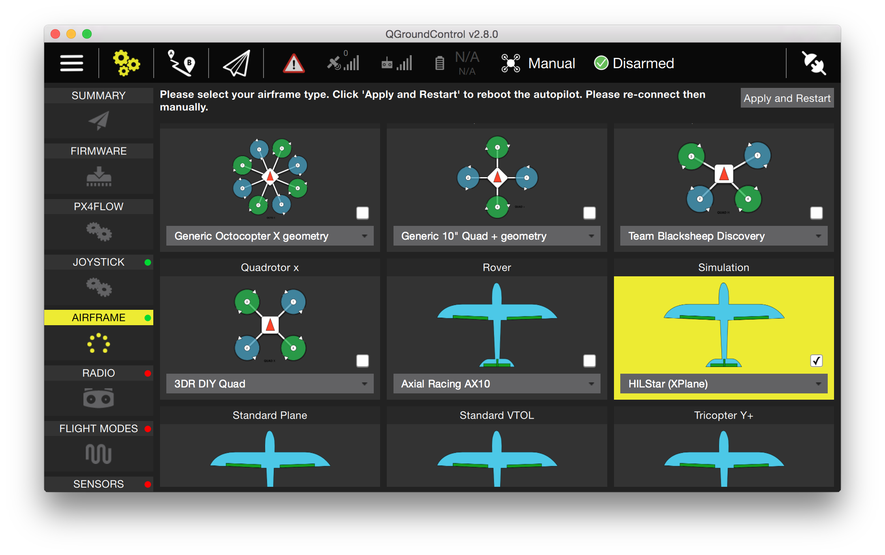
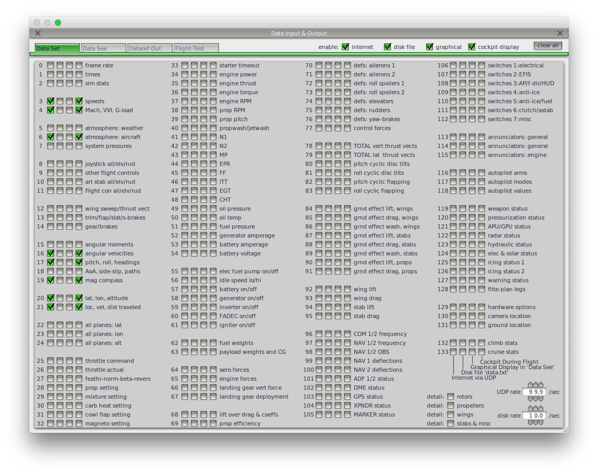

# Hardware in the Loop Simulation \(HITL\)

Hardware-in-the-Loop (HITL or HIL) is a simulation mode in which normal PX4 firmware is run on real flight controller hardware. This approach has the benefit of testing most of the actual flight code on the real hardware.

PX4 supports HITL for multicopters (using jMAVSim or Gazebo) and fixed wing (using Gazebo or X-Plane demo/full version).

## HITL-Compatible Airframes {#compatible_airframe}

The current set of compatible airframes vs Simulators is:

| Airframe                                                                                                | `SYS_AUTOSTART` | X-Plane | Gazebo | jMAVSim |
| ------------------------------------------------------------------------------------------------------- | --------------- | ------- | ------ | ------- |
| <a href="../airframes/airframe_reference.md#plane_simulation_(plane)_hilstar_(xplane)">HILStar (X-Plane)</a>                                                                               | 1000            | Y       |        |         |
| <a href="../airframes/airframe_reference.md#copter_simulation_(copter)_hil_quadcopter_x">HIL Quadcopter X</a>                                                                               | 1001            |         | Y      | Y       |
| <a href="../airframes/airframe_reference.md#vtol_standard_vtol_hil_standard_vtol_quadplane">HIL Standard VTOL QuadPlane</a>                                                                               | 1002            |         | Y      |         |
| [Standard planes](../airframes/airframe_reference.md#plane_standard_plane_standard_plane)               | 2100            | Y       |        |         |
| [Generic Quadrotor x](../airframes/airframe_reference.md#copter_quadrotor_x_generic_quadrotor_x) copter | 4001            |         | Y      | Y       |
| [DJI Flame Wheel f450](../airframes/airframe_reference.md#copter_quadrotor_x_dji_flame_wheel_f450)      | 4011            |         | Y      | Y       |

## HITL Simulation Environment {#simulation_environment}

With Hardware-in-the-Loop (HITL) simulation the normal PX4 firmware is run on real hardware. The HITL configuration is slightly different for Gazebo, jMAVSim and X-Plane.

> **Tip** For more information see: [Simulation](../simulation/README.md).

### JMAVSim/Gazebo HITL Environment

JMAVSim or Gazebo (running on a development computer) are connected to the flight controller hardware via USB/UART. The simulator acts as gateway to share MAVLink data between PX4 and *QGroundControl*.

> **Note** The simulator can also be connected via UDP if the flight controller has networking support and uses a stable, low-latency connection (e.g. a wired Ethernet connection - WiFi is usually not sufficiently reliable). For example, this configuration has been tested with PX4 running on a Raspberry Pi connected via Ethernet to the computer (a startup configuration that includes the command for running jMAVSim can be found [here](https://github.com/PX4/Firmware/blob/master/posix-configs/rpi/px4_hil.config)).

The diagram below shows the simulation environment:

* A HITL configuration is selected (via *QGroundControl*) that doesn't start any real sensors.
* *jMAVSim* or *Gazebo* are connected to the flight controller via USB.
* The simulator is connected to *QGroundControl* via UDP and bridges its MAVLink messages to PX4.
* *Gazebo* and *jMAVSim* can also connect to an offboard API and bridge MAVLink messages to PX4.
* (Optional) A serial connection can be used to connect Joystick/Gamepad hardware via *QGroundControl*.


### X-Plane HITL Environment

*QGroundControl* is connected to the flight controller hardware via USB, and acts as a gateway to forward data between the X-Plane simulator running on a development computer, PX4, and any offboard API. The diagram below shows the simulation environment:

* A HITL configuration is selected (via *QGroundControl*) that doesn't start any real sensors.
* *QGroundControl* is connected to the flight controller via USB.
* *QGroundControl* is connected to the simulator and offboard API via UDP.
* A serial connection is used to connect Joystick/Gamepad hardware via *QGroundControl*.


## HITL vs SITL

SITL runs on a development computer in a simulated environment, and uses firmware specifically generated for that environment. Other than simulation drivers to provide fake environmental data from the simulator the system behaves normally.

By contrast, HITL runs normal PX4 firmware in "HITL mode", on normal hardware. The simulation data enters the system at a different point than for SITL. Core modules like commander and sensors have HIL modes at startup that bypass some of the normal functionality.

In summary, HITL runs PX4 on the actual hardware using standard firmware, but SITL actually executes more of the standard system code.

## Setting up HITL

### PX4 Configuration

1. Connect the autopilot directly to *QGroundControl* via USB.
2. Enable HITL Mode
    
    1. Open **Setup > Safety** section.
    2. Enable HITL mode by selecting **Enabled** from the *HITL Enabled* list:
        
        

3. Select Airframe
    
    1. Open **Setup > Airframes**
    2. Select a [compatible airframe](#compatible_airframe) you want to test. Generally you'll select *HILStar* for Fixed Wing/X-Plane simulator and a *HIL QuadCopter* option for copters (and jMAVSim or Gazebo). Then click **Apply and Restart** on top-right of the *Airframe Setup* page.
        
        

4. Calibrate your RC or Joystick, if needed.

5. Setup UDP
    
    1. Under the *General* tab of the settings menu, uncheck all *AutoConnect* boxes except for **UDP**.
        
        

6. (Optional) Configure Joystick and Failsafe. Set the following [parameters](https://docs.px4.io/en/advanced_config/parameters.html#finding-a-parameter) in order to use a joystick instead of an RC remote control transmitter:
    
    * [COM_RC_IN_MODE](../advanced/parameter_reference.md#COM_RC_IN_MODE) to "Joystick/No RC Checks". This allows joystick input and disables RC input checks.
    * [NAV_RCL_ACT](../advanced/parameter_reference.md#NAV_RCL_ACT) to "Disabled". This ensures that no RC failsafe actions interfere when not running HITL with a radio control.
    
    > **Tip** The *QGroundControl User Guide* also has instructions on [Joystick](https://docs.qgroundcontrol.com/en/SetupView/Joystick.html) and [Virtual Joystick](https://docs.qgroundcontrol.com/en/SettingsView/VirtualJoystick.html) setup.

Once configuration is complete, **close** *QGroundControl* and disconnect the flight controller hardware from the computer.

### Simulator Setup

Follow the appropriate setup steps for your simulator in the following sections.

#### Gazebo

> **Note** Make sure *QGroundControl* is not running!

1. Update the environment variables:
    
    ```sh
    cd <Firmware_clone>
    make px4_sitl_default gazebo
    ```
    
    In a new terminal, run:
    
    ```sh
    source Tools/setup_gazebo.bash $(pwd) $(pwd)/build/px4_sitl_default
    ```

2. Open the vehicle model's sdf file (e.g. **Tools/sitl_gazebo/models/iris/iris.sdf**).

3. Under the `mavlink_interface plugin` section, change the `serialEnabled` and `hil_mode` parameters to `true`.
    
    

4. Replace the `serialDevice` parameter (`/dev/ttyACM0`) if necessary.
    
    > **Note** The serial device depends on what port is used to connect the vehicle to the computer (this is usually `/dev/ttyACM0`). An easy way to check on Ubuntu is to plug in the autopilot, open up a terminal, and type `dmesg | grep "tty"`. The correct device will be the last one shown.

5. Close Gazebo, connect the flight controller to the computer and wait for it to boot.

6. Run Gazebo in HITL mode 
        sh
        gazebo Tools/sitl_gazebo/worlds/iris.world

7. Start *QGroundControl*. It should autoconnect to PX4 and Gazebo.

#### jMAVSim (Quadrotor only)

> **Note** Make sure *QGroundControl* is not running!

1. Connect the flight controller to the computer and wait for it to boot.
2. Run jMAVSim in HITL mode (replace the serial port name `/dev/ttyACM0` if necessary - e.g. on Mac OS this would be `/dev/tty.usbmodem1`): 
        sh
        ./Tools/jmavsim_run.sh -q -s -d /dev/ttyACM0 -b 921600 -r 250

3. Start *QGroundControl*. It should autoconnect to PX4 and jMAVSim.

#### Using X-Plane (Fixed Wing only)

> **Note** X-Plane is currently not recommended. Among other issues, the frame update rate is too slow to run the system realistically.

To set up X-Plane:

1. Open X-Plane
2. In **Settings > Data Input and Output**, set these checkboxes:
    
    

3. In **Settings > Net Connections**, in the *Data* tab, set localhost and port 49005 as IP address, as shown below:
    
    

4. Enable X-Plane HITL in *QGroundControl*:
    
    1. Open *QGroundControl*
    2. Open **Widgets > HIL Config**. Select X-Plane 10 in the drop-down and hit connect. Once the system is connected, battery status, GPS status and aircraft position should all become valid.

## Fly an Autonomous Mission in HITL

You should be able to use *QGroundControl* to [run missions](../qgc/README.md#planning-missions) and otherwise control the vehicle.