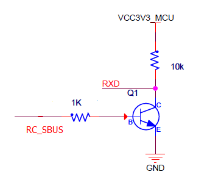
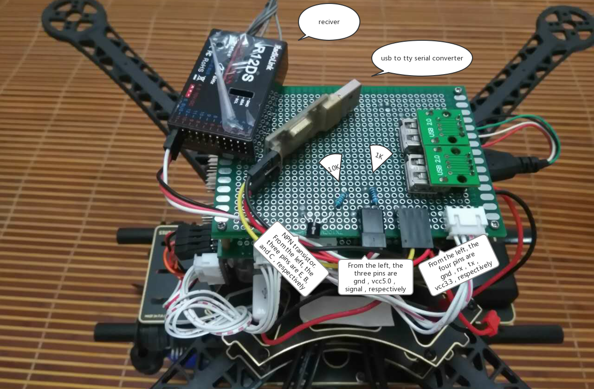

# 리눅스에 리모콘 수신기 연결 (S.Bus 포함)

이 절에서는 [지원 리모콘 수신기](https://docs.px4.io/master/en/getting_started/rc_transmitter_receiver.html)를 임의의 직렬 포트에 연결하고 사용할 목적으로 리눅스 기반 오토파일럿을 설정하는 방법을 알려드립니다.

S.Bus에 비해 원격 조종 타입은 수신기를 직렬 포트에 연결하거나 USB to TTY 직렬 케이블(PL2302 USB to Serial TTL 변환기)로 USB에 연결할 수 있습니다.

> **Note** S.Bus 수신기(또는 후타바, 래디오링크 등의 인코더)를 사용하는 목적이라면 보통 [신호 반전 회로](#signal_inverter_circuit)를 거쳐 수신기와 장치를 연결해야겠지만, 이외의 경우 설정은 동일합니다.

이후, 장치에서 다음과 같이 [PX4 원격 조정 드라이버를 시작](#start_driver)하십시오.

## Starting the Driver

To start the RC driver on a particular UART (e.g. in this case `/dev/ttyS2`):

    rc_input start -d /dev/ttyS2
    

For other driver usage information see: [rc_input](../middleware/modules_driver.md#rcinput).

## Signal Inverter Circuit (S.Bus only)

S.Bus is an *inverted* UART communication signal.

While some serial ports/flight controllers can read an inverted UART signal, most require a signal inverter circuit between the receiver and serial port to un-invert the signal.

> **Tip** 이 회로는 직렬 포트 또는 USB-to-TTY 직렬 변환기에서 S.Bus 원격 제어 신호를 읽는데 필요합니다.

This section shows how to create an appropriate circuit.

### 필요한 소자

* 1x NPN 트랜지스터 (예: NPN S9014 TO92)
* 1x 10K 저항
* 1x 1K 저항

> **Note** 전류 드레인 값이 상당히 낮으므로 트랜지스터를 어떤 형식/모델로 써도 상관 없습니다.

### 회로 구성도/연결

Connect the components as described below (and shown in the circuit diagram):

* S.Bus 신호선 &rarr; 1K 저항 &rarr; NPN 트랜지스터 베이스
* NPN 트랜지스터 에밋 &rarr; GND
* 3.3VCC &rarr; 10K 저항 &rarr; NPN 트랜지스터 컬렉션 &rarr; USB-to-TTY rxd
* 5.0VCC &rarr; S.Bus VCC
* GND &rarr; S.Bus GND

The image below shows the connections on a breadboard.

