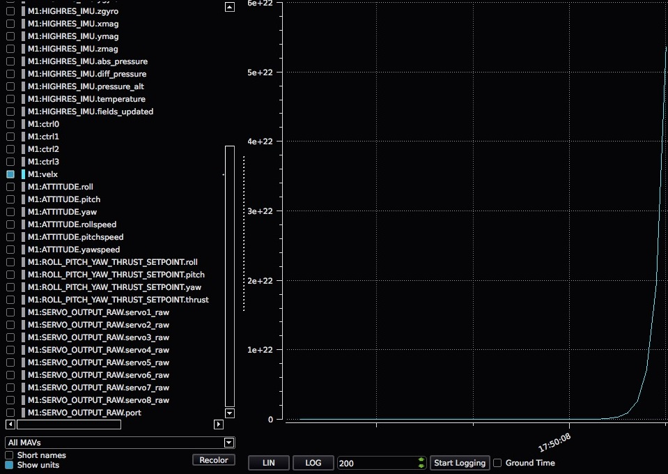

# Debug String / Float Pairs 보내기

소프트웨어 개발하는 동안 각자가 중요한 숫자를 출력하는 경우가 있습니다.
여기서는 MAVLink의 `NAMED_VALUE` 제네릭 패킷을 도입합니다.

## 파일

여기 튜터리얼에 관한 코드는 아래를 참고하세요. :

  * [Debug Tutorial Code](https://github.com/PX4/Firmware/blob/master/src/examples/px4_mavlink_debug/px4_mavlink_debug.c)
  * [Enable the tutorial app](https://github.com/PX4/Firmware/tree/master/cmake/configs) board 설정에서 mavlink debug app을 커맨트 처리를 없애서 활성화 시킴

아래 간단한 코드만 해주면 debug publication을 설정됩니다. 먼저 헤더 파일을 추가합니다. :

<div class="host-code"></div>

```C
#include <uORB/uORB.h>
#include <uORB/topics/debug_key_value.h>
```

다음으로 debug value topic(서로 다른 publish name들에 대해서 하나의 advertise로도 가능)을 advertise합니다. 이 부분을 main loop의 앞에 위치시킵니다. :

<div class="host-code"></div>

```C
/* advertise debug value */
struct debug_key_value_s dbg = { .key = "velx", .value = 0.0f };
orb_advert_t pub_dbg = orb_advertise(ORB_ID(debug_key_value), &dbg);
```

그리고 main loop에서 send부분은 더 간단합니다. :

<div class="host-code"></div>

```C
dbg.value = position[0];
orb_publish(ORB_ID(debug_key_value), pub_dbg, &dbg);
```

> **Caution** 여러 debug 메시지는 Mavlink가 이를 처리하려면 각 publish 사이에 충분한 시간이 주어져야 합니다. 즉 여러 debug 메시지를 publish하는 중간에 해당 코드는 대기하고 있거나 각 함수 호출 차례가 왔을 때 메시지를 선택하는 것이 가능합니다.

QGroundControl에서 결과는 실시간 표로 아래와 같이 볼 수 있습니다.:


