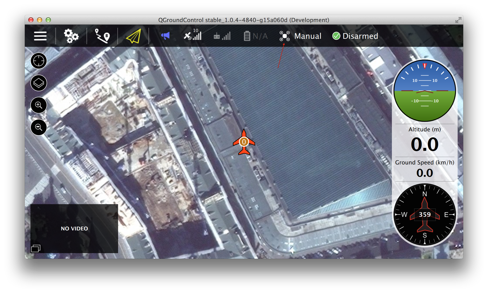

# QGroundControl

QGroundControl은 PX4 기반 autopilot을 설정하고 비행시킬 수 있는 어플리케이션입니다. 크로스 클랫폼으로 주요 운영체제를 지원합니다:

  * 모바일: 안드로이드와 iOS (현재 타블릿에 집중)
  * 데스크탑: Windows, Linux, Mac OS

## Planning Missions

새로운 미션을 계획하기 위해서 planning 탭으로 전환하고 왼쪽 상단 + 아이콘을 클릭하고 waypoint을 생성할 지도를 클릭합니다. 컨텍스트 메뉴는 waypoint를 조정하기 위해서 사이드에서 열립니다. 비행체에 이를 전송하기 위해서 하이라이트된 전송 아이콘을 클릭합니다.

## Flying Missions

flying 탭으로 전환합니다. mission이 지도상에 보여야 합니다. 현재 flight 모드를 클릭해서 MISSION으로 바꾸고 비행체를 arm시키기 위해서 DISARMED 스위치를 클릭합니다. 만약 비행체가 이미 비행 중이라면 미션의 첫번째 지점으로 날라가면서 순차적으로 이동합니다.

## Setting parameters

setup 탭으로 전환하세요. 왼쪽에 있는 메뉴를 내려서 밑으로 가서 파라미터 아이콘을 클릭합니다. 파라미터는 더블클릭해서 변경할 수 있습니다. 변경할 컨텍스트 메뉴를 열면 좀더 상세한 설명이 나타납니다.

## 설치

QGroundControl는 [웹사이트](http://qgroundcontrol.com/downloads)에서 다운받을 수 있습니다.

> **Tip** 개발자는 안정버전 대신에 데일리 빌드 비전을 사용하는 것을 추천합니다.

## 소스코드에서 빌드하기

펌웨어 개발자는 flight 코드와 최신 버전을 매칭시키려면 소스에서 빌드하는 것이 좋습니다.

Qt를 설치하고 소스 코드를 빌드를 위해 [QGroundControl 빌드 방법](https://github.com/mavlink/qgroundcontrol#obtaining-source-code)를 참고하세요.
