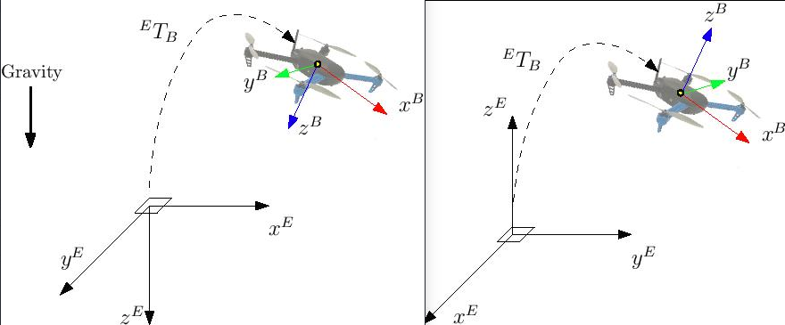

# 비젼 혹은 모션 캡쳐 시스템 사용하기

> **Info** 아래 내용을 따라하기 전에, 여러분의 autopilot의 펌웨어 버전이 LPE 모듈이 활성화되어 있는지 확인합니다. PX4 펌웨어의 LPE 버전은 최신 PX4 릴리즈의 zip 파일 내부 혹은 `make px4fmu-v2_lpe`와 같은 빌드명령으로 소스를 빌드하면 볼수 있습니다. 상세한 내용은 [코드 빌드하기](../setup/building_px4.md)를 참고하세요.

이 페이지의 목적은 GPS이 아닌 소스로부터(VICON과 Optitrack 같은 모션 캡쳐 시스템 그리고 [ROVIO](https://github.com/ethz-asl/rovio), [SVO](https://github.com/uzh-rpg/rpg_svo) 혹은 [PTAM](https://github.com/ethz-asl/ethzasl_ptam) )와 같은 비젼 기반 estimation 시스템) 위치 데이터를 사용하는 PX4 기반 시스템을 구성하는 것입니다.

position estimate는 오프보드(예로 VICON) 뿐만 아니라 온보드 컴퓨터가 보낼 수도 있습니다. 이 데이터는 로컬 기준에 상대적인 로컬 위치 estimate을 업데이트하는데 사용합니다. 비젼/모션 캡쳐 시스템에서 헤딩은 선택적으로 attitude estimator가 통합할 수도 있습니다.

시스템은 실내 position hold나 비젼 기반 waypoint 네비게이션과 같은 어플리케이션으로 사용될 수 있습니다.

비전에 관해서 pose data를 보내는데 사용하는 mavlink 메시지는 [VISION_POSITION_ESTIMATE](https://mavlink.io/en/messages/common.html#VISION_POSITION_ESTIMATE)와 모션 캡쳐 시스템에 관한 모든 메시지는 [ATT_POS_MOCAP](https://mavlink.io/en/messages/common.html#ATT_POS_MOCAP) 메시지입니다.

mavros ROS-Mavlink 인터페이스는 기본적으로 이런 메시지를 보내는 구현을 가지고 있습니다. 이 메시지는 순수 C/C++ 코드와 MAVLink 라이브러리를 직접 사용하는 방식으로 전달할 수 있습니다.

**이 기능은 LPE estimator로만 테스트되었습니다.**

## 비젼 혹은 Mocap을 위한 LPE 튜닝

### 외부 pose 입력 활성화
시스템에서 비젼/mocap 사용을 활성인 비활성화시키기 위해서 몇가지 파라미터를 설정해야 합니다.(QGroundControl 혹은 NSH 쉘 사용)

외부 헤딩 통합 기능을 활성화시키기 위해 `ATT_EXT_HDG_M`를 1이나 2로 설정합니다. 1로 설정하면 비젼이 사용되고 2로 설정하면 mocap 헤딩을 사용합니다.

비젼 통합은 기본적으로 LPE에서 활성화됩니다. QGroundControl에서 `LPE_FUSION` 파라미터를 사용해서 제어할 수 있습니다. "fuse vision position"이 체크되어 있는지 확인합니다.

#### barometer fusion 비활성화
비젼이나 mocap 정보로부터 높은 정확도의 고도 정보를 얻을 수 있다면 Z축에 드리프트를 줄이기 이해서 LPE에서 baro 보정을 비활성화시키는 것이 유용할 수 있습니다.

`LPE_FUSION` 파라미터에서 이에 대한 비트 필드가 있습니다. QGroundControl에서 설정할 수 있는데 "fuse baro"를 체크를 해제합니다.

#### 노이즈 파라미터 튜닝

비젼이나 mocap 데이터의 정확도가 높아서 estimator가 촘촘하게 track해나가길 원한다면, `LPE_VIS_XY` 와 `LPE_VIS_Z` (비젼에 대해서) 혹은 `LPE_VIC_P` (모션 캡쳐에 대해서)와 같은 표준 편차 파라미터를 줄여야 합니다. 이를 줄인다는 것은 estimator가 입력으로 들어오는 pose estimate를 더 신뢰하게 됩니다. 허용하는 최소와 force-save보다 더 낮게 설정해야 합니다.

> **Tip** 성능이 여전히 좋지 않다면, `LPE_PN_V` 파라미터 값을 증가시키세요. 이렇게 하면 velocity estimation 동안 측정값을 더 신뢰하게 됩니다.

## 레퍼런스 프레임에 대한 확인
이 섹션에서는 적합한 레퍼런스 프레임으로 시스템을 셋업하는 방법을 보여줍니다. 여러가지 표현이 있지만 여기서는 ENU와 NED 이렇게 2가지를 사용합니다.

* ENU는 그라운드-고정 프레임을 가지며 *x* 축이 동쪽을, *y* 는 북쪽을 *z* 는 위를 가리킵니다. Robot 프레임은 *x* 가 앞쪽, *z* 가 위를 그리고 *y* 옆을 가리킵니다.

* NED는 *x* 는 북쪽, *y* 는 동쪽 그리고 *z* 는 아래를 가리킵니다. Robot 프레임은 *x* 가 전방향, *z* 가 아래쪽 그리고 *y* 가 옆을 가리킵니다.

프레임은 아래 이미지와 같습니다: ENUrk 오른쪽인 반면에 NED는 왼쪽입니다.

외부 헤딩 estimation인 경우, 자기장 북쪽은 무시되고 *x* 축(mocap 칼리브레이션에서 자유롭게 위치시킬 수 있음)에 관련된 벡터로 속이게 됩니다. yaw 각은 로컬 *x* 에 따라 주어집니다.

> **Info** mocap 소프트웨어에서 고정 바디를 생성할 때, 먼저 robot을 *x* 축에 맞춰야하는 것을 명심합니다. 그렇지 않으면 yaw estimation은 초기 offset을 가지게 될지도 모릅니다.

### Mavros 사용하기

MAVROS에서 이런 동작은 간단합니다. ROS는 관습적으로 ENU 프레임을 사용하며, 포지션 피드백은 반드시 ENU로 제공해야만 합니다. 만약 Optitrack 시스템을 가지고 있다면 [mocap_optitrack](https://github.com/ros-drivers/mocap_optitrack) 노드를 사용해서 기존 ENU에 있는 ROS topic에서 object pose를 스트림으로 내보냅니다. remapping으로 직접 `mocap_pose_estimate`에서 publish할 수 있으며, 변환을 하지 않아도 되며 mavros는 NED 규칙만 신경쓰면 됩니다.

### Mavros 사용하지 않고
일반적으로 MAVROS나 ROS를 사용할 수 없다면, Mavlink 상에서 `ATT_POS_MOCAP` 메시지로 데이터를 스트림으로 내보낼 수 있습니다. 이 경우 시스템에 따라서 NED 규칙을 따라기 위해서 커스텀 변환을 적용해야할 수도 있습니다.

Optitrack 프레임워크 예제를 살펴봅시다;이 경우 로컬 프레임은 수평 비행체(*x* 전면과 *z* 오른쪽)에서 $$x$$ 와 $$z$$ 를 가지며 반면에 *y* 축은 수직으로 위를 가리킵니다. 단순한 트릭으로는 NED 규칙을 따르기 위해서 축을 맞바꾸는 것입니다.

*x_{mav}*, *y_{mav}* 그리고 *z_{mav}* 를 포지션 피드백으로 Mavlink를 통해 보낸 좌표계라고 부릅니다. 그리고 다음을 얻을 수 있습니다:

*x_{mav}* = *x_{mocap}*
*y_{mav}* = *z_{mocap}*
*z_{mav}* = - *y_{mocap}*

방향에 따라서 w를 동일하게 유지하고 쿼터니언 x y z를 동일한 방식으로 교환합니다. 모든 시스템에 대해서 이런 방법을 적용할 수 있습니다. NED 프레임을 얻기 위해 필요하며 mocap 출력을 보고 적절하게 축을 맞교환합니다.

## 처음 비행
이 시점까지 과정을 잘 따라왔다면 이제 셋업을 테스트할 준비가 된 것입니다.

다음 점검사항을 지키는지 확인합니다 :

* 고정 바디를 생성하기 **전에**, x 축으로 robot을 정렬합니다.

* Mavlink로 스트림으로 보내고 Qgroundcontrol에 있는 Mavlink inspector로 확인하며 local pose topic은 NED형태여야 합니다.

* robot을 손으로 움직이고 estimated local position이 일정한지를 봅니다.(항상 NED로)

* 수직 축으로 robot을 회전시키고 Mavlink inspector로 yaw를 검사합니다.

이런 단계들을 거치면, 처음 비행을 시도할 수 있습니다.

robot을 그라운드에 위치시키고 mocap 피드백을 스트림으로 내보내도록 합니다. 왼쪽 스틱을 낮추고 모터에 시동을 겁니다.

At this point, with the left stick at the lowest position, switch to position control. You should have a green light. The green light tells you that position feedback is available and position control is now activated.

Put your left stick at the middle, this is the dead zone. With this stick value, the robot maintain its altitude; rising the stick will increase the reference altitude while lowering the value will decrease it. Same for right stick on x and y.

Increase the value of the left stick and the robot will take off, put it back to the middle right after. Check if it is able to keep its position.

If it works, you may want to set up an [offboard](offboard_control.md) experiment by sending position-setpoint form a remote ground station.
