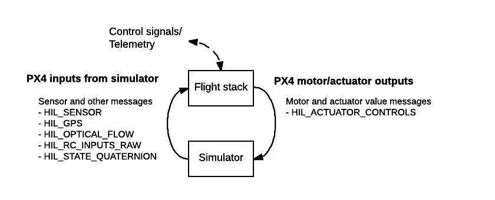
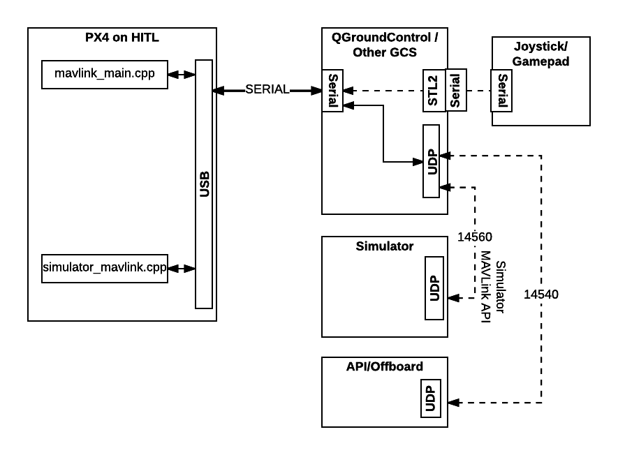

# Simulation

Simulators allow PX4 flight code to control a computer modeled vehicle in a simulated "world". You can interact with this vehicle just as you might with a real vehicle, using *QGroundControl*, an offboard API, or a radio controller/gamepad.

> **Tip** Simulation is a quick, easy, and most importantly, *safe* way to test changes to PX4 code before attempting to fly in the real world. It is also a good way to start flying with PX4 when you haven't yet got a vehicle to experiment with.

PX4 supports both *Software In the Loop (SITL)* simulation, where the flight stack runs on computer (either the same computer or another computer on the same network) and *Hardware In the Loop (HITL)* simulation using a simulation firmware on a real flight controller board.

Information about available simulators and how to set them up are provided in the next section. The other sections provide general information about how the simulator works, and are not required to *use* the simulators.


## Supported Simulators

The following simulators work with PX4 for HITL and/or SITL simulation.

Simulator |Description
---|---
[Gazebo](../simulation/gazebo.md) | <p><strong>This simulator is highly recommended.</strong></p><p>A powerful 3D simulation environment that is particularly suitable for testing object-avoidance and computer vision. It can also be used for <a href="../simulation/multi-vehicle-simulation.md">multi-vehicle Simulation</a> and is commonly used with <a href="../simulation/ros_interface.md">ROS</a>, a collection of tools for automating vehicle control. </p><p><strong>Supported Vehicles:</strong> Quad (<a href="../airframes/airframe_reference.md#copter_quadrotor_wide_3dr_iris_quadrotor">Iris</a> and <a href="../airframes/airframe_reference.md#copter_quadrotor_x_3dr_solo">Solo</a>), Hex (Typhoon H480), <a href="../airframes/airframe_reference.md#vtol_standard_vtol_generic_quad_delta_vtol">Generic quad delta VTOL</a>, Tailsitter, Plane, Rover, Submarine (coming soon!) </p>
[jMAVSim](../simulation/jmavsim.md) | A simple multirotor simulator that allows you to fly *copter* type vehicles around a simulated world. <p>It is easy to set up and can be used to test that your vehicle can take off, fly, land, and responds appropriately to various fail conditions (e.g. GPS failure).</p><p><strong>Supported Vehicles:</strong> Quad</p>
[AirSim](../simulation/airsim.md) | A cross platform simulator that provides physically and visually realistic simulations. This simulator is resource intensive, and requires a very significantly more powerful computer than the other simulators described here. <p><strong>Supported Vehicles:</strong> Iris (MultiRotor model and a configuration for PX4 QuadRotor in the X configuration).</p>
[XPlane](../simulation/hitl.md) (HITL only)| A comprehensive and powerful fixed-wing flight simulator that offers very realistic flight models.<br><p><strong>Supported Vehicles:</strong> Plane</p>

Instructions for how to setup and use the simulators are in the topics linked above.


---
The remainder of this topic is a "somewhat generic" description of how the simulation infrastructure works. It is not required to *use* the simulators.


## Simulator MAVLink API

All simulators communicate with PX4 using the Simulator MAVLink API. This API defines a set of MAVLink messages that supply sensor data from the simulated world to PX4 and return motor and actuator values from the flight code that will be applied to the simulated vehicle. The image below shows the message flow.



> **Note** A simulator build of PX4 (both SITL and HITL) uses [simulator_mavlink.cpp](https://github.com/PX4/Firmware/blob/master/src/modules/simulator/simulator_mavlink.cpp) to handle these messages. Sensor data from the simulator is written to a dummy driver and appears "real" to PX4. All motors / actuators are blocked, but internal software is fully operational.

The messages are described below (see links for specific detail).

Message | Direction | Description
--- | --- | ---
[MAV_MODE:MAV_MODE_FLAG_HIL_ENABLED](https://mavlink.io/en/messages/common.html#MAV_MODE_FLAG_HIL_ENABLED) | NA | Mode flag when using simulation. All motors/actuators are blocked, but internal software is fully operational.
[HIL_ACTUATOR_CONTROLS](https://mavlink.io/en/messages/common.html#HIL_ACTUATOR_CONTROLS) | PX4 to Sim | PX4 control outputs (to motors, actuators).
[HIL_SENSOR](https://mavlink.io/en/messages/common.html#HIL_SENSOR) | Sim to PX4 | Simulated IMU readings in SI units in NED body frame.
[HIL_GPS](https://mavlink.io/en/messages/common.html#HIL_GPS) | Sim to PX4 | The simulated GPS RAW sensor value.
[HIL_OPTICAL_FLOW](https://mavlink.io/en/messages/common.html#HIL_OPTICAL_FLOW) | Sim to PX4 | Simulated optical flow from a flow sensor (e.g. PX4FLOW or optical mouse sensor)
[HIL_STATE_QUATERNION](https://mavlink.io/en/messages/common.html#HIL_STATE_QUATERNION) | Sim to PX4 | Contains the actual "simulated" vehicle position, attitude, speed etc. This can be logged and compared to PX4's estimates for analysis and debugging (for example, checking how well an estimator works for noisy (simulated) sensor inputs).
[HIL_RC_INPUTS_RAW](https://mavlink.io/en/messages/common.html#HIL_RC_INPUTS_RAW) | Sim to PX4 | The RAW values of the RC channels received.


## Standard MAVLink UDP Ports

PX4 defines a number of standard UDP broadcast ports that ground control stations (e.g. *QGroundControl*, Offboard APIs and simulators) can listen to in order to connect to the autopilot:

- Offboard APIs: 14540
- Ground Control Stations: 14550  (*QGroundControl* automatically connects to PX4 broadcasting on this port).
- Simulators: 14560

> **Note** The "connection model" is that PX4 broadcasts to the standard ports above; other systems listen and respond to the source port in the PX4 messages. The ports for the GCS and offboard APIs are set in configuration files, while the simulator broadcast port is hard-coded in the simulation MAVLink module.


## SITL Simulation Environment

The diagram below shows a typical SITL simulation environment for any of the supported simulators. The different parts of the system connect via UDP, and can be run on either the same computer or another computer on the same network.

* PX4 uses a simulation-specific module to broadcast on UDP port 14560. Simulators listen to this port, then connect and exchange information using the [Simulator MAVLink API](#simulator-mavlink-api) described above. SITL and the simulator can run on either the same computer or different computers on the same network.
* PX4 uses the normal MAVLink module to set up UDP connections for *QGroundControl* (broadcast port: 14550, listen: 14557) and external developer APIs like DroneCore or ROS (broadcast: 14540, listen: 14557).
* A serial connection is used to connect Joystick/Gamepad hardware via *QGroundControl*.


If you use the normal build system SITL `make` configuration targets (see next section) then both SITL and the Simulator will be launched on the same computer and the ports above will automatically be configured. You can configure additional MAVLink UDP connections and otherwise modify the simulation environment in the build configuration and initialisation files.


### Starting/Building SITL Simulation

The build system makes it very easy to build and start PX4 on SITL, launch a simulator, and connect them. For example, you can launch a SITL version of PX4 that uses the EKF2 estimator and simulate a plane in Gazebo with just the following command (provided all the build and gazebo dependencies are present!):
```
make posix_sitl_ekf2 gazebo_plane
```

> **Tip** It is also possible to separately build and start SITL and the various simulators, but this is nowhere near as "turnkey".

The syntax to call `make` with a particular configuration and initialisation file is:

```bash
make [CONFIGURATION_TARGET] [SIMULATOR]_[INIT_FILE]
```

where:
* **CONFIGURATION_TARGET:** has the format `[OS]_[PLATFORM]_[FEATURE]`
  * **OS:** posix, nuttx, qurt
  * **PLATFORM:** SITL (or in principle any platform supported among the different OS: bebop, eagle, excelsior, etc.)
  * **FEATURE:** A particular high level feature - for example which estimator to use (ekf2, lpe) or to run tests or simulate using a replay.
  > **Tip** You can get a list of all available configuration targets using the command:
  ```
  make list_config_targets
  ```
* **SIMULATOR:** The simulator to launch and connect: gazebo, jmavsim <!-- , ?airsim -->
* **INIT_FILE:** The specific init file to use for PX4 launch, within the associated configuration target. This might define the start up for a particular vehicle, or allow simulation of multiple vehicles (we explain how to determine available init files in the next section).


### Init File Location

The settings for each configuration target are defined in appropriately named files in [/Firmware/cmake/configs](https://github.com/PX4/Firmware/tree/master/cmake/configs). Within each file there is a setting `config_sitl_rcS_dir` that defines the location of the folder where the configuration stores its init files.

In the cmake config file for [posix_sitl_ekf2](https://github.com/PX4/Firmware/blob/master/cmake/configs/posix_sitl_ekf2.cmake) you can see that the init file will be stored in the folder: **Firmware/posix-configs/SITL/init/ekf2/**.
```bash
set(config_sitl_rcS_dir
    posix-configs/SITL/init/ekf2
    )
```    

> **Note** Generally the init files are located using a consistent folder naming convention. For example, `make posix_sitl_ekf2 gazebo_iris` corresponds to the following folder structure:
```
Firmware/
  posix-configs/  (os=posix)
    SITL/         (platform=sitl)
      init/       
        ekf2/     (feature=ekf2)
          iris    (init file name)
```


### Example Startup File

A slightly reduced version of the startup file for `make posix_sitl_ekf2 gazebo_iris` ([/Firmware/posix-configs/SITL/init/ekf2/iris](https://github.com/PX4/Firmware/blob/master/posix-configs/SITL/init/ekf2/iris)) is shown below.

```bash
uorb start
param load
dataman start
param set BAT_N_CELLS 3
param set CAL_ACC0_ID 1376264
param set CAL_ACC0_XOFF 0.01
...
...
param set SYS_MC_EST_GROUP 2
param set SYS_RESTART_TYPE 2
replay tryapplyparams
simulator start -s
tone_alarm start
gyrosim start
accelsim start
barosim start
adcsim start
gpssim start
pwm_out_sim mode_pwm
sensors start
commander start
land_detector start multicopter
navigator start
ekf2 start
mc_pos_control start
mc_att_control start
mixer load /dev/pwm_output0 ROMFS/px4fmu_common/mixers/quad_dc.main.mix
mavlink start -u 14556 -r 4000000
mavlink start -u 14557 -r 4000000 -m onboard -o 14540
mavlink stream -r 50 -s POSITION_TARGET_LOCAL_NED -u 14556
mavlink stream -r 50 -s LOCAL_POSITION_NED -u 14556
mavlink stream -r 50 -s GLOBAL_POSITION_INT -u 14556
mavlink stream -r 50 -s ATTITUDE -u 14556
mavlink stream -r 50 -s ATTITUDE_QUATERNION -u 14556
mavlink stream -r 50 -s ATTITUDE_TARGET -u 14556
mavlink stream -r 50 -s SERVO_OUTPUT_RAW_0 -u 14556
mavlink stream -r 20 -s RC_CHANNELS -u 14556
mavlink stream -r 250 -s HIGHRES_IMU -u 14556
mavlink stream -r 10 -s OPTICAL_FLOW_RAD -u 14556
logger start -e -t
mavlink boot_complete
replay trystart
```

Note the sections that set parameters, start simulator drivers and other modules. A few of the more relevant lines for simulation are highlighted below.

1. Simulator being started:
   ```
   simulator start -s
   ```
1. PWM out mode being set for simulator:
   ```
   pwm_out_sim mode_pwm
   ```
1. Set MAVLink ports:

   * This line starts the MAVLink instance for connecting to offboard APIs. It broadcasts on 14540 and listens for responses on 14557. The `-m onboard` flag specifies a set of messages that will be streamed over the interface.
      ```bash
      mavlink start -u 14557 -r 4000000 -m onboard -o 14540
      ```
   * This line starts MAVLink instance for connecting to *QGroundControl*/GCSs. PX4 listens for messages on port 14556.
   ```bash
   mavlink start -u 14556 -r 4000000
   ```
      * The broadcast port is not explicitly set (the default is used: 14550).
      * The messages that are streamed over this interface are specified using `mavlink stream` as shown below:
        ```
        mavlink stream -r 50 -s POSITION_TARGET_LOCAL_NED -u 14556
        mavlink stream -r 50 -s LOCAL_POSITION_NED -u 14556
        ...
        ```

For more information about using the MAVLink module see [Modules Reference: Communication > MAVLink](../middleware/modules_communication.md#mavlink).


## HITL Simulation Environment

With Hardware-in-the-Loop (HITL) simulation the normal PX firmware is run on real hardware. *QGroundControl* is connected to the physical hardware over USB and acts as a gateway to forward data between the simulator, PX4 and any offboard API.

The diagram below shows a typical HITL simulation environment:
* A HITL configuration is selected (via *QGroundControl*) that doesn't start any real sensors.
* *QGroundControl* is connected to the flight controller via the USB.
* *QGroundControl* is connected to the simulator and offboard API via UDP.
* A serial connection is used to connect Joystick/Gamepad hardware via *QGroundControl*.




## Joystick/Gamepad Integration

*QGroundControl* desktop versions can connect to a USB Joystick/Gamepad and send its movement commands and button presses to PX4 over MAVLink. This works on both SITL and HITL simulations, and allows you to directly control the simulated vehicle. If you don't have a joystick you can alternatively control the vehicle using QGroundControl's onscreen virtual thumbsticks.  

For setup information see the *QGroundControl User Guide*:
* [Joystick Setup](https://docs.qgroundcontrol.com/en/SetupView/Joystick.html)
* [Virtual Joystick](https://docs.qgroundcontrol.com/en/SettingsView/VirtualJoystick.html)

<!-- FYI Airsim info on this setting up remote controls: https://github.com/Microsoft/AirSim/blob/master/docs/remote_controls.md -->
