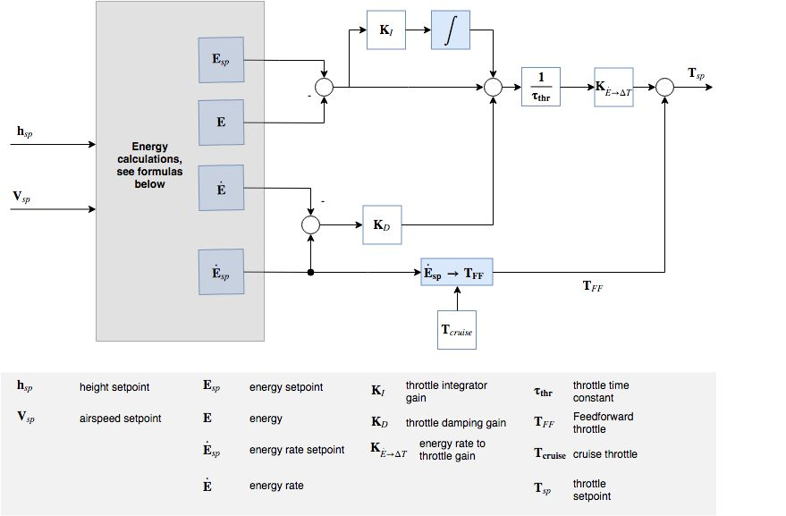
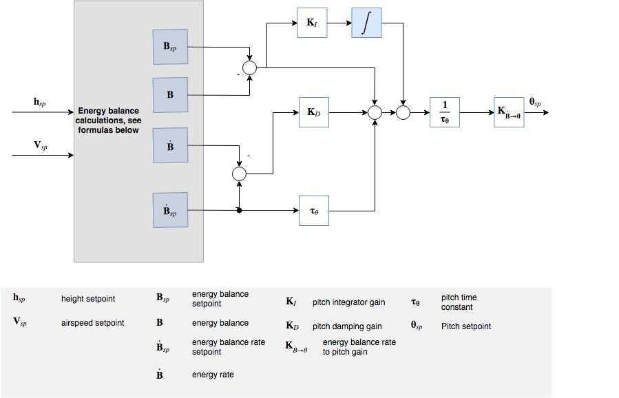
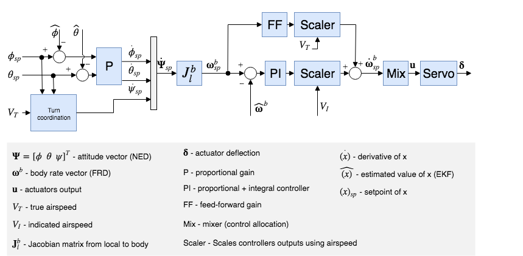

# 控制器图解

本节包括PX4主要控制器的图解。

图解使用标准的 [PX4 符号](../contribute/notation.md) (附有详细图例注解)。

## 多旋翼位置控制器

<!-- The drawing is on draw.io: https://drive.google.com/open?id=13Mzjks1KqBiZZQs15nDN0r0Y9gM_EjtX
Request access from dev team. -->

* 状态估计来自 [EKF2](https://docs.px4.io/en/advanced_config/tuning_the_ecl_ekf.html) 模块。
* 这是一个标准的位置-速度级联控制回路。
* 在某些模式，外环(位置回路) 可能会被绕过 (图中在外环之后增加一个多路开关来表示)。 只有在位置保持模式或某轴无速度请求时，位置回路才会发挥作用。
* 内环（加速度）控制器使用箝位法对积分器做了抗饱和处理（ARW）。

## 固定翼位置控制器

### 总能量控制系统

通过总能量控制系统(TECS)，PX4可以持续得对固定翼飞行器的真空速和高度进行控制。 这其中的代码通过一个用库（这个库是用于固定翼位置控制模块）作为接口。

从上面的图表可以看出，总能量控制系统接受空速和高度需求量，然后输出油门和俯仰角控制量。 这两个输出控制量输入到固定翼的姿态控制器（姿态控制器实施姿态控制） 因此，总能量控制系统是直接受到俯仰控制逻辑环的性能影响 对飞行器俯仰角度的预测不准往往会导致对空速和高度的预测不准。

> **Note** 在试图调试总能量控制系统前，请一定要调试好姿态控制器。

对真空速和高度的持续跟踪控制不是一个简单的事情。 增加飞行器的俯仰角度不仅会导致高度上升还会导致空速下降。 增加油门会使空速增加但是也会使升力变大从而使高度也增加。 因此，俯仰角和油门两个输入量都会对空速和高度产生影响，从而使控制问题变得难了。

总能量控制系统通过能量法来解决这个问题，而不是通过之前的那种设定点进行控制。 一架飞行器的总能量包括动能和势能。 推力（通过油门控制）增加整个飞机的总能量。 A given total energy state can be achieved by arbitrary combinations of potential and kinetic energies. In other words, flying at a high altitude but at a slow speed can be equivalent to flying at a low altitude but at a faster airspeed in a total energy sense. We refer to this as the specific energy balance and it is calculated from the current altitude and true airspeed setpoint. The specific energy balance is controlled via the aircraft pitch angle. An increase in pitch angle transfers kinetic to potential energy and a negative pitch angle vice versa. The control problem was therefore decoupled by transforming the initial setpoints into energy quantities which can be controlled independently. We use thrust to regulate the specific total energy of the vehicle and pitch maintain a specific balance between potential (height) and kinetic (speed) energy.

#### Total energy control loop

#### Total energy balance control loop

The total energy of an aircraft is the sum of kinetic and potential energy:

$$E_T = \frac{1}{2} m V_T^2 + m g h$$,

Taking the derivative with respect to time leads to the total energy rate:

$$\dot{E_T} = m V_T \dot{V_T} + m g \dot{h}$$.

From this, the specific energy rate can be formed as:

$$\dot{E} = \frac{\dot{E_T}}{mgV_T} = \frac{\dot{V_T}}{g} + \frac{\dot{h}}{V_T} = \frac{\dot{V_T}}{g} + sin(\gamma) $$

where $$\gamma$$ is the flight plan angle. For small $$\gamma$$ we can approximate this as

$$ \dot{E} \approx \frac{\dot{V_T}}{g} + \gamma $$.

From the dynamic equations of an aircraft we get the following relation:

$$ T - D = mg(\frac{\dot{V_T}}{g} + sin(\gamma)) \approx mg(\frac{\dot{V_T}}{g} + \gamma) $$,

where T and D are the thrust and drag forces. In level flight, initial thrust is trimmed against the drag and a change in thrust results thus in:

$$ \Delta T = mg(\frac{\dot{V_T}}{g} + \gamma) $$.

As can be seen, $$\Delta T$$ is proportional to $$\dot{E}$$, and thus the thrust setpoint should be used for total energy control.

Elevator control on the other hand is energy conservative, and is thus used for exchanging potentional energy for kinetic energy and vice versa. To this end, a specific energy balance rate is defined as

$$\dot{B} = \gamma - \frac{\dot{V_T}}{g}$$.

## Fixed-Wing Attitude Controller

<!-- The drawing is on draw.io: https://drive.google.com/file/d/1ibxekmtc6Ljq60DvNMplgnnU-JOvKYLQ/view?usp=sharing
Request access from dev team. -->

The attitude controller works using a cascaded loop method. The outer loop computes the error between the attitude setpoint and the estimated attitude that, multiplied by a gain (P controller), generates a rate setpoint. The inner loop then computes the error in rates and uses a PI (proportional + integral) controller to generate the desired angular acceleration.

The angular position of the control effectors (ailerons, elevators, rudders, ...) is then computed using this desired angular acceleration and a priori knowledge of the system through control allocation (also known as mixing). Furthermore, since the control surfaces are more effective at high speed and less effective at low speed, the controller - tuned for cruise speed - is scaled using the airspeed measurements (if such a sensor is used).

> **Note** If no airspeed sensor is used then gain scheduling for the FW attitude controller is disabled (it's open loop); no correction is/can be made in TECS using airspeed feedback.

The feedforward gain is used to compensate for aerodynamic damping. Basically, the two main components of body-axis moments on an aircraft are produced by the control surfaces (ailerons, elevators, rudders, - producing the motion) and the aerodynamic damping (proportional to the body rates - counteracting the motion). In order to keep a constant rate, this damping can be compensated using feedforward in the rate loop.

The roll and pitch controllers have the same structure and the longitudinal and lateral dynamics are assumed to be uncoupled enough to work independently. The yaw controller, however, generates its yaw rate setpoint using the turn coordination constraint in order to minimize lateral acceleration, generated when the aircraft is slipping. The yaw rate controller also helps to counteract adverse yaw effects (https://youtu.be/sNV_SDDxuWk) and to damp the [Dutch roll mode](https://en.wikipedia.org/wiki/Dutch_roll) by providing extra directional damping.

## VTOL 飞行控制器

<!-- The drawing is on draw.io: https://drive.google.com/file/d/1tVpmFhLosYjAtVI46lfZkxBz_vTNi8VH/view?usp=sharing
Request access from dev team. -->

本节简要介绍垂直起降（VTOL）无人机的控制结构。 垂直起降飞行控制器由多旋翼控制器和固定翼控制器组成，多旋翼控制器在垂直起降模式下运行，固定翼控制器在平飞模式下运行，二者在过渡模式下同时运行。 上图是一个简化的控制流程图。 注意到 VTOL 姿态控制器模块，它主要对不同 VTOL 模式间的必要切换和混控逻辑，以及过渡模式下 VTOL 机型的特定控制动作（例如，在前向过渡期间加速标准 VTOL 的推进马达）起到促进作用。 此模块的输入称为“虚拟输入”，因为控制器会根据当前的 VTOL 模式而忽略一些输入。

对于标准和倾转旋翼 VTOL，在过渡期间，固定翼姿态控制器产生角速率期望值，然后将其输入到单独的角速率控制器中，从而产生多旋翼和固定翼执行器的扭矩指令。 而对尾座式 VTOL，在过渡期间，多旋翼姿态控制器独立运行。

VTOL姿态模块的输出是多旋翼执行器（典型的 `actuator_controls_0`）和固定翼（典型的 `actuator_controls_1`）执行器的独立的扭矩和力指令。 这些是在一个特定机型的混控器文件中处理的（参见[ Mixing](../concept/mixing.md)）。

有关调整 VTOL 模块内部过渡逻辑的更多信息，请参阅 [VTOL 配置](https://docs.px4.io/en/config_vtol/)。 

### 空速缩放

The objective of this section is to explain with the help of equations why and how the output of the rate PI and feedforward (FF) controllers can be scaled with airspeed to improve the control performance. We will first present the simplified linear dimensional moment equation on the roll axis, then show the influence of airspeed on the direct moment generation and finally, the influence of airspeed during a constant roll.

As shown in the fixed-wing attitude controller above, the rate controllers produce angular acceleration setpoints for the control allocator (here named "mixer"). In order to generate these desired angular accelerations, the mixer produces torques using available aerodynamic control surfaces (e.g.: a standard airplane typically has two ailerons, two elevators and a rudder). The torques generated by those control surfaces is highly influenced by the relative airspeed and the air density, or more precisely, by the dynamic pressure. If no airspeed scaling is made, a controller tightly tuned for a certain cruise airspeed will make the aircraft oscillate at higher airspeed or will give bad tracking performance at low airspeed.

The reader should be aware of the difference between the [true airspeed (TAS)](https://en.wikipedia.org/wiki/True_airspeed) and the [indicated airspeed (IAS)](https://en.wikipedia.org/wiki/Indicated_airspeed) as their values are significantly different when not flying at sea level.

The definition of the dynamic pressure is

$$\bar{q} = \frac{1}{2} \rho V_T^2$$,

where $$\rho$$ is the air density and $$V_T$$ the true airspeed (TAS).

Taking the roll axis for the rest of this section as an example, the dimensional roll moment can be written

$$\ell = \frac{1}{2}\rho V_T^2 S b C_\ell = \bar{q} S b C_\ell$$,

where $$\ell$$ is the roll moment, $$b$$ the wing span and $$S$$ the reference surface.

The nondimensional roll moment derivative $$C_\ell$$ can be modeled using the aileron effectiveness derivative $$C_{\ell_{\delta_a}}$$, the roll damping derivative $$C_{\ell_p}$$ and the dihedral derivative $$C_{\ell_\beta}$$

$$C_\ell = C_{\ell_0} + C_{\ell_\beta}\:\beta + C_{\ell_p}\:\frac{b}{2V_T}\:p + C_{\ell_{\delta_a}} \:\delta_a$$,

where $$\beta$$ is the sideslip angle, $$p$$ the body roll rate and $$\delta_a$$ the aileron deflection.

Assuming a symmetric ($$C_{\ell_0} = 0$$) and coordinated ($$\beta = 0$$) aircraft, the equation can be simplified using only the rollrate damping and the roll moment produced by the ailerons

$$\ell = \frac{1}{2}\rho V_T^2 S b \left [C_{\ell_{\delta_a}} \:\delta_a + C_{\ell_p}\:\frac{b}{2V_T} \: p \right ]$$.

This final equation is then taken as a baseline for the two next subsections to determine the airspeed scaling expression required for the PI and the FF controllers.

#### Static torque (PI) scaling

At a zero rates condition ($$p = 0$$), the damping term vanishes and a constant - instantaneous - torque can be generated using

$$\ell = \frac{1}{2}\rho V_T^2 S b \: C_{\ell_{\delta_a}} \:\delta_a = \bar{q} S b \: C_{\ell_{\delta_a}} \:\delta_a$$.

Extracting $$\delta_a$$ gives

$$\delta_a = \frac{2bS}{C_{\ell_{\delta_a}}} \frac{1}{\rho V_T^2} \ell = \frac{bS}{C_{\ell_{\delta_a}}} \frac{1}{\bar{q}} \ell$$,

where the first fraction is constant and the second one depends on the air density and the true airspeed squared.

Furthermore, instead of scaling with the air density and the TAS, it can be shown that the indicated airspeed (IAS, $$V_I$$) is inherently adjusted by the air density since at low altitude and speed, IAS can be converted to TAS using a simple density error factor

$$V_T = V_I \sqrt{\frac{\rho_0}{\rho}}$$,

where $$\rho_o$$ is the air density as sea level, 15°C.

Squaring, rearranging and adding a 1/2 factor to both sides makes the dynamic pressure $$\bar{q}$$ expression appear

$$\bar{q} = \frac{1}{2} \rho V_T^2 = \frac{1}{2} V_I^2 \rho_0$$.

We can now easily see that the dynamic pressure is proportional to the IAS squared

$$\bar{q} \propto V_I^2$$.

The scaler previously containing TAS and the air density can finally be written using IAS only

$$\delta_a = \frac{2bS}{C_{\ell_{\delta_a}}\rho_0} \frac{1}{V_I^2} \ell$$.

#### Rate (FF) scaling

The main use of the feedforward of the rate controller is to compensate for the natural rate damping. Starting again from the baseline dimensional equation but this time, during a roll at constant speed, the torque produced by the ailerons should exactly compensate for the damping such as

$$- C_{\ell_{\delta_a}} \:\delta_a = C_{\ell_p} \frac{b}{2 V_T} \: p$$.

Rearranging to extract the ideal ailerons deflection gives

$$\delta_a = -\frac{b \: C_{\ell_p}}{2 \: C_{\ell_{\delta_a}}} \frac{1}{V_T} \: p$$.

The first fraction gives the value of the ideal feedforward and we can see that the scaling is linear to the TAS. Note that the negative sign is then absorbed by the roll damping derivative which is also negative.

#### Conclusion

The output of the rate PI controller has to be scaled with the indicated airspeed (IAS) squared and the output of the rate feedforward (FF) has to be scaled with the true airspeed (TAS)

$$\delta_{a} = \frac{V_{I_0}^2}{V_I^2} \delta_{a_{PI}} + \frac{V_{T_0}}{V_T} \delta_{a_{FF}}$$,

where $$V_{I_0}$$ and $$V_{T_0}$$ are the IAS and TAS at trim conditions.

Finally, since the actuator outputs are normalized and that the mixer and the servo blocks are assumed to be linear, we can rewrite this last equation as follows

$$\dot{\mathbf{\omega}}*{sp}^b = \frac{V*{I_0}^2}{V_I^2} \dot{\mathbf{\omega}}*{sp*{PI}}^b + \frac{V_{T_0}}{V_T} \dot{\mathbf{\omega}}*{sp*{FF}}^b$$,

and implement it directly in the rollrate, pitchrate and yawrate controllers.

#### Tuning recommendations

The beauty of this airspeed scaling algorithm is that it does not require any specific tuning. However, the quality of the airspeed measurements directly influences its performance.

Furthermore, to get the largest stable flight envelope, one should tune the attitude controllers at an airspeed value centered between the stall speed and the maximum airspeed of the vehicle (e.g.: an airplane that can fly between 15 and 25m/s should be tuned at 20m/s). This "tuning" airspeed should be set in the [FW_AIRSPD_TRIM](../advanced/parameter_reference.md#FW_AIRSPD_TRIM) parameter.